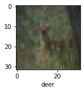
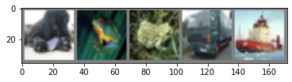
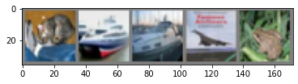
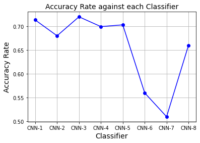
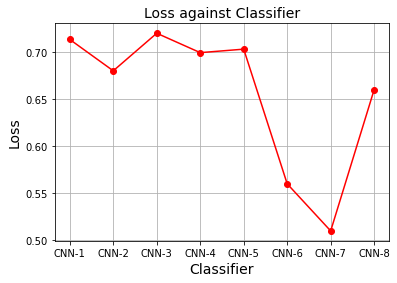

The goal of this project is to build a CIFAR-10 image classifier using pytorch and tensorflow. In this project, different classifiers are built using different parameter tuning for the purposes of comparisons. 

To compare the performances among the fitted models, we will compute the predicted accuracy and the estimated loss of each model. We will also plot graphs of accuracies and estimated losses against the fitted models for easy comparisons. The performances of each model will be based on the predictive accuracy on the test data. 

The layout of this project is organized as follows; in section 1, we import the require libraries and data necessary for this project. We also report the dimensions of the dataset, both training and test dataset, display some images of the data and finally normalize the dataset. In section 2, we will fit 5 different models using tensorflow and also perform a classification report for each class in the test data using the optimal model in this category. In section 3, 3 different models will also be fitted using pytorch and classification reports for each class in the test data will also be computed. In section 4, we will select our overall optimal model, and also plot graphs of the accuracies and the losses against each model for easy comparison and visualization. Finally in Section 5, we end our discussion by some concluding remarks and contributions. 

## 1.0 Libraries

```python
import torch
import torchvision
import torchvision.transforms as transforms
import matplotlib.pyplot as plt
import numpy as np
import torch.nn as nn
import torch.nn.functional as F
import torch.optim as optim
import tensorflow as tf
from tensorflow.keras import datasets, layers, models
from keras.preprocessing.image import ImageDataGenerator
from sklearn.metrics import confusion_matrix, classification_report
from matplotlib import pyplot
```

1.1 Import Dataset

In this project, we will use the CIFAR10 dataset. This data has about 60000 images of the following classes: ‘airplane’, ‘automobile’, ‘bird’, ‘cat’, ‘deer’, ‘dog’, ‘frog’, ‘horse’, ‘ship’, ‘truck’. The images in the CIFAR-10 dataset are of size 3x32x32, that is, 3-channel color images of size 32x32 pixels. In this project, we will split the dataset into training set and test set. The split ratio is 80% training set, which will be used to train our classifier, and 20% test set, which will be used to validate our trained model. 

Reference: The reference code for this project can be obtained from the following links:

Pytorch: 

1. https://pytorch.org/tutorials/beginner/blitz/neural_networks_tutorial.html
2. https://pytorch.org/docs/stable/generated/torch.nn.Module.html#torch.nn.Module

Tensorflow:

3. https://machinelearningmastery.com/category/deep-learning/page/7/
4. https://www.youtube.com/watch?v=7HPwo4wnJeA&t=24s

```python
# Import data: This data will be used to build the classifier using pytorch
transform = transforms.Compose(
    [transforms.ToTensor(),
     transforms.Normalize((0.5, 0.5, 0.5), (0.5, 0.5, 0.5))])

batch_size = 5

trainset = torchvision.datasets.CIFAR10(root='./data', train=True,
                                        download=True, transform=transform)
trainloader = torch.utils.data.DataLoader(trainset, batch_size=batch_size,
                                          shuffle=True, num_workers=2)

testset = torchvision.datasets.CIFAR10(root='./data', train=False,
                                       download=True, transform=transform)
testloader = torch.utils.data.DataLoader(testset, batch_size=batch_size,
                                         shuffle=False, num_workers=2)
```

```
Files already downloaded and verified
Files already downloaded and verified
```

```python
#Import data: This data will be use build the classifier under tensorflow
(x_train, y_train), (x_test, y_test) = datasets.cifar10.load_data()
```

Data Structure and Dimension

```python
x_train.shape
```

```
(50000, 32, 32, 3)
```

```python
x_test.shape
```

```
(10000, 32, 32, 3)
```

```python
y_train = y_train.reshape(-1,)
y_train[:5]
```

```
array([6, 9, 9, 4, 1], dtype=uint8)
```

```python
# Image classes of the dataset
classes = ('plane', 'car', 'bird', 'cat','deer', 'dog', 'frog', 'horse', 'ship', 'truck')
```

```python
# Display an image of from the train data
def plot_sample(x, y, index) :
    plt.figure(figsize = (15, 2))
    plt.imshow(x[index])
    plt.xlabel(classes[y[index]])
```

```python
plot_sample(x_train, y_train, 10)
```



```python
# Display some 5 random training images
def imshow(img):
    img = img / 2 + 0.5     # unnormalize
    npimg = img.numpy()
    plt.imshow(np.transpose(npimg, (1, 2, 0)))
    plt.show()

dataiter = iter(trainloader)
images, labels = dataiter.next()

# show images
imshow(torchvision.utils.make_grid(images))
# print labels
print(' '.join('%5s' % classes[labels[j]] for j in range(batch_size)))
```



```
  dog  frog  frog truck  ship
```

1.2 Normalize Dataset

We normalized the dataset, both the train and test, to take values between 0 and 1. 

```python
x_train = x_train / 255
x_test = x_test / 255
```

## 2.0 Training the classifier using tensorflow

The following five different classifiers are trained in this section using tensorflow;

1. 2 simple 2-convolutional layer classifiers with different filter sizes
2. 3 3-convolutional layer classifiers with different numbers of fully connected layers and filter sizes.
   The input shape for each classifier in this section is 32X32X3, and the ReLu activation was used in the input layer for each classifier. For all classifiers in this category, the "Adam" optimizer and the sparse categorical crossentropy loss were also used. "Softmax" was used as activation in the output layer. Epochs for all classifiers was set at 10.

2.1 Train a 2-layer CNN Model

```python
cnn1 = models.Sequential([
    #cnn
    layers.Conv2D(filters = 64, kernel_size = (3, 3), activation = 'relu', input_shape = (32, 32, 3)),
    layers.MaxPooling2D((2,2)),
    
    layers.Conv2D(filters=128, kernel_size=(3, 3), activation='relu'),
    layers.MaxPooling2D((2,2)),
    
    #dense
    layers.Flatten(),
    layers.Dense(128, activation='relu'),
    layers.Dense(10, activation='softmax')]
)

cnn1.compile(optimizer = 'adam', 
            loss = 'sparse_categorical_crossentropy', 
            metrics = ['accuracy'])
```

```python
cnn2 = tf.keras.models.Sequential()
cnn2.add(tf.keras.layers.Conv2D(filters=32, kernel_size=3, activation='relu', input_shape=[32, 32, 3]))
cnn2.add(tf.keras.layers.MaxPool2D(2, 2))
cnn2.add(tf.keras.layers.Conv2D(filters=32, kernel_size=3, activation='relu'))
cnn2.add(tf.keras.layers.MaxPool2D(2, 2))
cnn2.add(tf.keras.layers.Flatten())
cnn2.add(tf.keras.layers.Dense(units=128, activation='relu'))
cnn2.add(tf.keras.layers.Dense(units=10, activation='softmax'))

cnn2.compile(optimizer = 'adam', 
             loss = 'sparse_categorical_crossentropy', 
             metrics = ['accuracy'])
```

2.1.1 Test Model

For the 2-convolutional layer networw, it turns out that classifier 1 (CNN-1) has an accuracy rate of 71.3% and a loss of 0.854 on the test test data whiles classifier 2 (CNN-2) has an accuracy rate of 68% and a loss of 0.927 from the same test data. This implies CNN-1 has outperformed CNN-2. See the results below.

```python
cnn1.fit(x_train, y_train, epochs=5)
```

```
Epoch 1/5
1563/1563 [==============================] - 43s 27ms/step - loss: 1.3668 - accuracy: 0.5096
Epoch 2/5
1563/1563 [==============================] - 42s 27ms/step - loss: 1.0084 - accuracy: 0.6495
Epoch 3/5
1563/1563 [==============================] - 43s 27ms/step - loss: 0.8632 - accuracy: 0.6991
Epoch 4/5
1563/1563 [==============================] - 44s 28ms/step - loss: 0.7543 - accuracy: 0.7388
Epoch 5/5
1563/1563 [==============================] - 44s 28ms/step - loss: 0.6666 - accuracy: 0.7696


<keras.callbacks.History at 0x7f9ba2355880>
```

```python
cnn1.evaluate(x_test, y_test)
```

```
313/313 [==============================] - 2s 6ms/step - loss: 0.8540 - accuracy: 0.7133


[0.8540308475494385, 0.7132999897003174]
```

```python
cnn2.fit(x_train, y_train, epochs=5)
```

```
Epoch 1/5
1563/1563 [==============================] - 23s 13ms/step - loss: 1.4661 - accuracy: 0.4715
Epoch 2/5
1563/1563 [==============================] - 19s 12ms/step - loss: 1.1301 - accuracy: 0.6024
Epoch 3/5
1563/1563 [==============================] - 20s 13ms/step - loss: 0.9946 - accuracy: 0.6532
Epoch 4/5
1563/1563 [==============================] - 20s 13ms/step - loss: 0.9033 - accuracy: 0.6846
Epoch 5/5
1563/1563 [==============================] - 20s 13ms/step - loss: 0.8271 - accuracy: 0.7118


<keras.callbacks.History at 0x7f9b888151f0>
```

```python
cnn2.evaluate(x_test, y_test)
```

```
313/313 [==============================] - 1s 3ms/step - loss: 0.9267 - accuracy: 0.6800


[0.9266972541809082, 0.6800000071525574]
```

 2.2.0 Train a 3-layer CNN Model.

Classifier 3 (CNN-3) below is a 3-convolutional layer with 2 fully connected layers, classifier 4 (CNN-4) below is a 3-convolutional layer with 3 fully connected layers, and classifier 5 (CNN-5) below is a 3-convolutional layer with 3 fully connected layers. Different filter sizes are used to fit each classifier.

```python
cnn3 = models.Sequential([
    #cnn
    layers.Conv2D(filters = 64, kernel_size = (3, 3), activation = 'relu', input_shape = (32, 32, 3)),
    layers.MaxPooling2D((2,2)),
    
    layers.Conv2D(filters=128, kernel_size=(3, 3), activation='relu'),
    layers.MaxPooling2D((2,2)),
    
    layers.Conv2D(filters=256, kernel_size=(3, 3), activation='relu'),
    layers.MaxPooling2D((2,2)),
    
    #dense
    layers.Flatten(),
    layers.Dense(120, activation='relu'),
    layers.Dense(64, activation='relu'),
    layers.Dense(10, activation='softmax')]
)

cnn3.compile(optimizer = 'adam', 
             loss = 'sparse_categorical_crossentropy', 
             metrics = ['accuracy'])
```

```python
cnn4 = models.Sequential([
    #cnn
    layers.Conv2D(filters = 64, kernel_size = (3, 3), activation = 'relu', input_shape = (32, 32, 3)),
    layers.MaxPooling2D((2,2)),
    
    layers.Conv2D(filters=128, kernel_size=(3, 3), activation='relu'),
    layers.MaxPooling2D((2,2)),
    
    layers.Conv2D(filters=256, kernel_size=(3, 3), activation='relu'),
    layers.MaxPooling2D((2,2)),
    
    #dense
    layers.Flatten(),
    layers.Dense(256, activation='relu'),
    layers.Dense(120, activation='relu'),
    layers.Dense(64, activation='relu'),
    layers.Dense(10, activation='softmax')]
)

cnn4.compile(optimizer = 'adam', 
             loss = 'sparse_categorical_crossentropy', 
             metrics = ['accuracy'])
```

```python
cnn5 = models.Sequential([
    #cnn
    layers.Conv2D(filters = 64, kernel_size = (3, 3), activation = 'relu', input_shape = (32, 32, 3)),
    layers.MaxPooling2D((2,2)),
    
    layers.Conv2D(filters=128, kernel_size=(3, 3), activation='relu'),
    layers.MaxPooling2D((2,2)),
    
    layers.Conv2D(filters=256, kernel_size=(3, 3), activation='relu'),
    layers.MaxPooling2D((2,2)),
    
    #dense
    layers.Flatten(),
    layers.Dense(128, activation='relu'),
    layers.Dense(64, activation='relu'),
    layers.Dense(32, activation='relu'),
    layers.Dense(10, activation='softmax')]
)

cnn5.compile(optimizer = 'adam', 
             loss = 'sparse_categorical_crossentropy', 
             metrics = ['accuracy'])
```

The results below shows that CNN-3 performs better with an accuracy rate of 72% and a loss of 0.825. CNN-4 has an accuracy of 70% and a loss of 0.878, and CNN-5 has an accuracy of 70.3% and a loss of 0.877.

```python
cnn3.fit(x_train, y_train, epochs = 5)
```

```
Epoch 1/5
1563/1563 [==============================] - 56s 36ms/step - loss: 1.4905 - accuracy: 0.4555
Epoch 2/5
1563/1563 [==============================] - 51s 32ms/step - loss: 1.0810 - accuracy: 0.6178
Epoch 3/5
1563/1563 [==============================] - 57s 36ms/step - loss: 0.8883 - accuracy: 0.6907
Epoch 4/5
1563/1563 [==============================] - 49s 31ms/step - loss: 0.7589 - accuracy: 0.7344
Epoch 5/5
1563/1563 [==============================] - 50s 32ms/step - loss: 0.6691 - accuracy: 0.7668


<keras.callbacks.History at 0x7f9b9711e790>
```

```python
cnn3.evaluate(x_test, y_test)
```

```
313/313 [==============================] - 2s 7ms/step - loss: 0.8247 - accuracy: 0.7199


[0.8246857523918152, 0.7199000120162964]
```

```python
cnn4.fit(x_train, y_train, epochs = 5)
```

```
Epoch 1/5
1563/1563 [==============================] - 53s 33ms/step - loss: 1.5742 - accuracy: 0.4141
Epoch 2/5
1563/1563 [==============================] - 54s 34ms/step - loss: 1.1277 - accuracy: 0.5969
Epoch 3/5
1563/1563 [==============================] - 51s 33ms/step - loss: 0.9328 - accuracy: 0.6709
Epoch 4/5
1563/1563 [==============================] - 53s 34ms/step - loss: 0.7964 - accuracy: 0.7211
Epoch 5/5
1563/1563 [==============================] - 53s 34ms/step - loss: 0.6982 - accuracy: 0.7569


<keras.callbacks.History at 0x7f9bf2235c70>
```

```python
cnn4.evaluate(x_test, y_test)
```

```
313/313 [==============================] - 3s 9ms/step - loss: 0.8775 - accuracy: 0.6993


[0.8775103688240051, 0.6992999911308289]
```

```python
cnn5.fit(x_train, y_train, epochs = 5)
```

```
Epoch 1/5
1563/1563 [==============================] - 51s 32ms/step - loss: 1.5757 - accuracy: 0.4166
Epoch 2/5
1563/1563 [==============================] - 51s 33ms/step - loss: 1.1375 - accuracy: 0.5936
Epoch 3/5
1563/1563 [==============================] - 52s 34ms/step - loss: 0.9438 - accuracy: 0.6668
Epoch 4/5
1563/1563 [==============================] - 55s 35ms/step - loss: 0.8114 - accuracy: 0.7154
Epoch 5/5
1563/1563 [==============================] - 53s 34ms/step - loss: 0.7162 - accuracy: 0.7510


<keras.callbacks.History at 0x7f9b57e881c0>
```

```python
cnn5.evaluate(x_test, y_test)
```

```
313/313 [==============================] - 2s 7ms/step - loss: 0.8773 - accuracy: 0.7030


[0.8773043155670166, 0.703000009059906]
```

2.3.0 Classification reports on each class

The table below reports the accuracies and losses of each of the five classifiers built above. It's observed that, classifier 3 (CNN-3), the 3-convolutional layer with 2 fully connected layers performed better than other four models. Hence the optimal model based on tensorflow is CNN-3

```python
from pandas import DataFrame

model1 = {'Model': ['CNN-1', 'CNN-2', 'CNN-3', 'CNN-4', 'CNN-5'],
       'Accuracy': [0.7133, 0.6800, 0.7199, 0.6993,0.7030],
       'Loss': [0.8540, 0.9267, 0.8247, 0.8775,0.8773]}          
modeldata = DataFrame(model1)   # creating DataFrame from dictionary
modeldata     
```

<div>
<style scoped>
    .dataframe tbody tr th:only-of-type {
        vertical-align: middle;
    }

```
.dataframe tbody tr th {
    vertical-align: top;
}

.dataframe thead th {
    text-align: right;
}
```

</style>
<table border="1" class="dataframe">
  <thead>
    <tr style="text-align: right;">
      <th></th>
      <th>Model</th>
      <th>Accuracy</th>
      <th>Loss</th>
    </tr>
  </thead>
  <tbody>
    <tr>
      <th>0</th>
      <td>CNN-1</td>
      <td>0.7133</td>
      <td>0.8540</td>
    </tr>
    <tr>
      <th>1</th>
      <td>CNN-2</td>
      <td>0.6800</td>
      <td>0.9267</td>
    </tr>
    <tr>
      <th>2</th>
      <td>CNN-3</td>
      <td>0.7199</td>
      <td>0.8247</td>
    </tr>
    <tr>
      <th>3</th>
      <td>CNN-4</td>
      <td>0.6993</td>
      <td>0.8775</td>
    </tr>
    <tr>
      <th>4</th>
      <td>CNN-5</td>
      <td>0.7030</td>
      <td>0.8773</td>
    </tr>
  </tbody>
</table>
</div>

A classification report based on the optimal classifier, CNN-3, in this section are presented below.

```python
y_pred = cnn3.predict(x_test)
y_pred_classes = [np.argmax(element) for element in y_pred]
print("Classification Report: \n", classification_report(y_test, y_pred_classes))
```

```
Classification Report: 
               precision    recall  f1-score   support

           0       0.79      0.73      0.76      1000
           1       0.80      0.89      0.84      1000
           2       0.60      0.62      0.61      1000
           3       0.50      0.64      0.56      1000
           4       0.68      0.63      0.65      1000
           5       0.69      0.54      0.60      1000
           6       0.83      0.75      0.79      1000
           7       0.73      0.78      0.75      1000
           8       0.80      0.86      0.83      1000
           9       0.84      0.75      0.79      1000

    accuracy                           0.72     10000
   macro avg       0.73      0.72      0.72     10000
weighted avg       0.73      0.72      0.72     10000
```

## 3.0 Training the classifier using pytorch

In this section 3 different classifiers are trained for comparisons;

1. 2 convolutional layers with 2 fully connected layers
2. 2 convolutional layers with 3 fully connected layers
3. 3 convolutional layers with 3 fully connected layers

The filter sizes for each classifier in this section is varied and we used the Classification Cross-Entropy loss and SGD with momentum equals to 0.9 and learning rate of 0.001 for all classifiers.

```python
# Train the CNN-6 classifier
class Net(nn.Module):
    def __init__(self):
        super().__init__()
        self.conv1 = nn.Conv2d(3, 6, 5)
        self.pool = nn.MaxPool2d(2, 2)
        self.conv2 = nn.Conv2d(6, 16, 5)
        self.fc1 = nn.Linear(16 * 5 * 5, 120)
        self.fc2 = nn.Linear(120, 10)

    def forward(self, x):
        x = self.pool(F.relu(self.conv1(x)))
        x = self.pool(F.relu(self.conv2(x)))
        x = torch.flatten(x, 1) # flatten all dimensions except batch
        x = F.relu(self.fc1(x))
        x = self.fc2(x)
        return x


net0 = Net()
criterion = nn.CrossEntropyLoss()
optimizer = optim.SGD(net0.parameters(), lr=0.001, momentum=0.9)
```

```python
for epoch in range(2):  # loop over the dataset multiple times

    running_loss = 0.0
    for i, data in enumerate(trainloader, 0):
        # get the inputs; data is a list of [inputs, labels]
        inputs, labels = data

        # zero the parameter gradients
        optimizer.zero_grad()

        # forward + backward + optimize
        outputs = net0(inputs)
        loss = criterion(outputs, labels)
        loss.backward()
        optimizer.step()

        # print statistics
        running_loss += loss.item()
        if i % 2000 == 1999:    # print every 2000 mini-batches
            print('[%d, %5d] loss: %.3f' %
                  (epoch + 1, i + 1, running_loss / 2000))
            running_loss = 0.0

print('Finished Training')
```

```
[1,  2000] loss: 2.047
[1,  4000] loss: 1.713
[1,  6000] loss: 1.563
[1,  8000] loss: 1.500
[1, 10000] loss: 1.439
[2,  2000] loss: 1.376
[2,  4000] loss: 1.322
[2,  6000] loss: 1.284
[2,  8000] loss: 1.275
[2, 10000] loss: 1.238
Finished Training
```

```python
# test CNN-6 using the test data
dataiter = iter(testloader)
images, labels = dataiter.next()

# print images
imshow(torchvision.utils.make_grid(images))
print('GroundTruth: ', ' '.join('%5s' % classes[labels[j]] for j in range(5)))

outputs = net0(images)

_, predicted = torch.max(outputs, 1)

print('Predicted: ', ' '.join('%5s' % classes[predicted[j]]
                              for j in range(5)))

correct = 0
total = 0
# since we're not training, we don't need to calculate the gradients for our outputs
with torch.no_grad():
    for data in testloader:
        images, labels = data
        # calculate outputs by running images through the network
        outputs = net0(images)
        # the class with the highest energy is what we choose as prediction
        _, predicted = torch.max(outputs.data, 1)
        total += labels.size(0)
        correct += (predicted == labels).sum().item()

print('Accuracy of the network on the 10000 test images: %d %%' % (
    100 * correct / total))
```


```
GroundTruth:    cat  ship  ship plane  frog
Predicted:   frog   car plane plane  deer
Accuracy of the network on the 10000 test images: 56 %
```

```python
# Train CNN-7 classifier
class Net(nn.Module):
    def __init__(self):
        super().__init__()
        self.conv1 = nn.Conv2d(3, 6, 5)
        self.pool = nn.MaxPool2d(2, 2)
        self.conv2 = nn.Conv2d(6, 16, 5)
        self.fc1 = nn.Linear(16 * 5 * 5, 120)
        self.fc2 = nn.Linear(120, 84)
        self.fc3 = nn.Linear(84, 10)

    def forward(self, x):
        x = self.pool(F.relu(self.conv1(x)))
        x = self.pool(F.relu(self.conv2(x)))
        x = torch.flatten(x, 1) # flatten all dimensions except batch
        x = F.relu(self.fc1(x))
        x = F.relu(self.fc2(x))
        x = self.fc3(x)
        return x


net1 = Net()
criterion = nn.CrossEntropyLoss()
optimizer = optim.SGD(net1.parameters(), lr=0.001, momentum=0.9)
```

```python
for epoch in range(2):  # loop over the dataset multiple times

    running_loss = 0.0
    for i, data in enumerate(trainloader, 0):
        # get the inputs; data is a list of [inputs, labels]
        inputs, labels = data

        # zero the parameter gradients
        optimizer.zero_grad()

        # forward + backward + optimize
        outputs = net1(inputs)
        loss = criterion(outputs, labels)
        loss.backward()
        optimizer.step()

        # print statistics
        running_loss += loss.item()
        if i % 2000 == 1999:    # print every 2000 mini-batches
            print('[%d, %5d] loss: %.3f' %
                  (epoch + 1, i + 1, running_loss / 2000))
            running_loss = 0.0

print('Finished Training')
```

```
[1,  2000] loss: 2.169
[1,  4000] loss: 1.817
[1,  6000] loss: 1.665
[1,  8000] loss: 1.578
[1, 10000] loss: 1.504
[2,  2000] loss: 1.440
[2,  4000] loss: 1.403
[2,  6000] loss: 1.366
[2,  8000] loss: 1.333
[2, 10000] loss: 1.292
Finished Training
```

Test the cnn model

```python
#Test CNN-7 using test data
dataiter = iter(testloader)
images, labels = dataiter.next()

# print images
imshow(torchvision.utils.make_grid(images))
print('GroundTruth: ', ' '.join('%5s' % classes[labels[j]] for j in range(4)))

outputs = net1(images)

_, predicted = torch.max(outputs, 1)

print('Predicted: ', ' '.join('%5s' % classes[predicted[j]]
                              for j in range(4)))

correct = 0
total = 0
# since we're not training, we don't need to calculate the gradients for our outputs
with torch.no_grad():
    for data in testloader:
        images, labels = data
        # calculate outputs by running images through the network
        outputs = net1(images)
        # the class with the highest energy is what we choose as prediction
        _, predicted = torch.max(outputs.data, 1)
        total += labels.size(0)
        correct += (predicted == labels).sum().item()

print('Accuracy of the network on the 10000 test images: %d %%' % (
    100 * correct / total))
```



```
GroundTruth:    cat  ship  ship plane
Predicted:    cat  ship  ship  ship
Accuracy of the network on the 10000 test images: 51 %
```

```python
#Train CNN-8 classifier
class Net(nn.Module):
    def __init__(self):
        super().__init__()
        self.conv1 = nn.Conv2d(3, 200, 5)
        self.pool = nn.MaxPool2d(2, 2)
        self.conv2 = nn.Conv2d(200, 300, 5)
        self.conv3 = nn.Conv2d(300, 400, 5)
        self.fc1 = nn.Linear(400* 1 * 1, 200)
        self.fc2 = nn.Linear(200, 400)
        self.fc3 = nn.Linear(400, 10)

    def forward(self, x):
        x = self.pool(F.relu(self.conv1(x)))
        x = self.pool(F.relu(self.conv2(x)))
        x = F.relu(self.conv3(x))
        x = torch.flatten(x, 1) # flatten all dimensions except batch
        x = F.relu(self.fc1(x))
        x = F.relu(self.fc2(x))
        x = self.fc3(x)
        return x


net2 = Net()
criterion = nn.CrossEntropyLoss()
optimizer = optim.SGD(net2.parameters(), lr=0.001, momentum=0.9)
```

```python
for epoch in range(2):  # loop over the dataset multiple times

    running_loss = 0.0
    for i, data in enumerate(trainloader, 0):
        # get the inputs; data is a list of [inputs, labels]
        inputs, labels = data

        # zero the parameter gradients
        optimizer.zero_grad()

        # forward + backward + optimize
        outputs = net2(inputs)
        loss = criterion(outputs, labels)
        loss.backward()
        optimizer.step()

        # print statistics
        running_loss += loss.item()
        if i % 2000 == 1999:    # print every 2000 mini-batches
            print('[%d, %5d] loss: %.3f' %
                  (epoch + 1, i + 1, running_loss / 2000))
            running_loss = 0.0

print('Finished Training')
```

```
[1,  2000] loss: 2.081
[1,  4000] loss: 1.659
[1,  6000] loss: 1.486
[1,  8000] loss: 1.362
[1, 10000] loss: 1.254
[2,  2000] loss: 1.154
[2,  4000] loss: 1.100
[2,  6000] loss: 1.043
[2,  8000] loss: 1.001
[2, 10000] loss: 0.967
Finished Training
```

```python
#Test CNN-8 classifier on test data
dataiter = iter(testloader)
images, labels = dataiter.next()

# print images
imshow(torchvision.utils.make_grid(images))
print('GroundTruth: ', ' '.join('%5s' % classes[labels[j]] for j in range(5)))

outputs = net2(images)

_, predicted = torch.max(outputs, 1)

print('Predicted: ', ' '.join('%5s' % classes[predicted[j]]
                              for j in range(5)))

correct = 0
total = 0
# since we're not training, we don't need to calculate the gradients for our outputs
with torch.no_grad():
    for data in testloader:
        images, labels = data
        # calculate outputs by running images through the network
        outputs = net2(images)
        # the class with the highest energy is what we choose as prediction
        _, predicted = torch.max(outputs.data, 1)
        total += labels.size(0)
        correct += (predicted == labels).sum().item()

print('Accuracy of the network on the 10000 test images: %d %%' % (
    100 * correct / total))
```


```
GroundTruth:    cat  ship  ship plane  frog
Predicted:    cat  ship  ship plane  frog
Accuracy of the network on the 10000 test images: 66 %
```

3.1 Test results

The table below presents the model accuracies and losses of each classifer in this section. It turns out that, CNN-8,the 3 convolutional layers with 3 fully connected layers performed better the other two models with an accuracy rate of 66% and a loss of 0.967. Therefore, CNN-8 is the optimal classifier using pytorch.

```python
model2 = {'Model': ['CNN-6', 'CNN-7', 'CNN-8'],
       'Accuracy': [0.56, 0.51, 0.66],
       'Loss': [1.238, 1.292, 0.967]}          
modeldata1 = DataFrame(model2)   # creating DataFrame from dictionary
modeldata1 
```

<div>
<style scoped>
    .dataframe tbody tr th:only-of-type {
        vertical-align: middle;
    }

```
.dataframe tbody tr th {
    vertical-align: top;
}

.dataframe thead th {
    text-align: right;
}
```

</style>
<table border="1" class="dataframe">
  <thead>
    <tr style="text-align: right;">
      <th></th>
      <th>Model</th>
      <th>Accuracy</th>
      <th>Loss</th>
    </tr>
  </thead>
  <tbody>
    <tr>
      <th>0</th>
      <td>CNN-6</td>
      <td>0.56</td>
      <td>1.238</td>
    </tr>
    <tr>
      <th>1</th>
      <td>CNN-7</td>
      <td>0.51</td>
      <td>1.292</td>
    </tr>
    <tr>
      <th>2</th>
      <td>CNN-8</td>
      <td>0.66</td>
      <td>0.967</td>
    </tr>
  </tbody>
</table>
</div>

A classification report of each class based on the optimal model, CNN-8, is presented below.

```python
# prepare to count predictions for each class
correct_pred = {classname: 0 for classname in classes}
total_pred = {classname: 0 for classname in classes}

# again no gradients needed
with torch.no_grad():
    for data in testloader:
        images, labels = data
        outputs = net2(images)
        _, predictions = torch.max(outputs, 1)
        # collect the correct predictions for each class
        for label, prediction in zip(labels, predictions):
            if label == prediction:
                correct_pred[classes[label]] += 1
            total_pred[classes[label]] += 1


# print accuracy for each class
for classname, correct_count in correct_pred.items():
    accuracy = 100 * float(correct_count) / total_pred[classname]
    print("Accuracy for class {:5s} is: {:.1f} %".format(classname,
                                                   accuracy))
```

```
Accuracy for class plane is: 78.8 %
Accuracy for class car   is: 78.9 %
Accuracy for class bird  is: 42.1 %
Accuracy for class cat   is: 49.6 %
Accuracy for class deer  is: 57.8 %
Accuracy for class dog   is: 66.0 %
Accuracy for class frog  is: 62.9 %
Accuracy for class horse is: 65.2 %
Accuracy for class ship  is: 82.1 %
Accuracy for class truck is: 77.8 %
```

Visualization of accuracies against models 

```python
model3 = {'Model': ['CNN-1', 'CNN-2', 'CNN-3', 'CNN-4', 'CNN-5','CNN-6','CNN-7','CNN-8'],
       'Accuracy': [0.7133, 0.6800, 0.7199, 0.6993,0.7030,0.5600, 0.5100, 0.6600],
       'Loss': [0.8540, 0.9267, 0.8247, 0.8775,0.8773,1.2380, 1.2920, 0.9670]}          
modeldata3 = DataFrame(model3)   # creating DataFrame from dictionary
modeldata3   
```

<div>
<style scoped>
    .dataframe tbody tr th:only-of-type {
        vertical-align: middle;
    }

```
.dataframe tbody tr th {
    vertical-align: top;
}

.dataframe thead th {
    text-align: right;
}
```

</style>
<table border="1" class="dataframe">
  <thead>
    <tr style="text-align: right;">
      <th></th>
      <th>Model</th>
      <th>Accuracy</th>
      <th>Loss</th>
    </tr>
  </thead>
  <tbody>
    <tr>
      <th>0</th>
      <td>CNN-1</td>
      <td>0.7133</td>
      <td>0.8540</td>
    </tr>
    <tr>
      <th>1</th>
      <td>CNN-2</td>
      <td>0.6800</td>
      <td>0.9267</td>
    </tr>
    <tr>
      <th>2</th>
      <td>CNN-3</td>
      <td>0.7199</td>
      <td>0.8247</td>
    </tr>
    <tr>
      <th>3</th>
      <td>CNN-4</td>
      <td>0.6993</td>
      <td>0.8775</td>
    </tr>
    <tr>
      <th>4</th>
      <td>CNN-5</td>
      <td>0.7030</td>
      <td>0.8773</td>
    </tr>
    <tr>
      <th>5</th>
      <td>CNN-6</td>
      <td>0.5600</td>
      <td>1.2380</td>
    </tr>
    <tr>
      <th>6</th>
      <td>CNN-7</td>
      <td>0.5100</td>
      <td>1.2920</td>
    </tr>
    <tr>
      <th>7</th>
      <td>CNN-8</td>
      <td>0.6600</td>
      <td>0.9670</td>
    </tr>
  </tbody>
</table>
</div>

```python
%matplotlib inline

Classifier = ['CNN-1','CNN-2','CNN-3','CNN-4','CNN-5','CNN-6','CNN-7','CNN-8']
Accuracy_Rate = [0.7133,0.6800,0.7199,0.6993,0.7030,0.5600,0.5100,0.6600]
  
plt.plot(Classifier, Accuracy_Rate, color='blue', marker='o')
plt.title('Accuracy Rate against Classifier', fontsize=14)
plt.xlabel('Classifier', fontsize=14)
plt.ylabel('Accuracy Rate', fontsize=14)
plt.grid(True)
plt.show()
```



```python
Classifier = ['CNN-1','CNN-2','CNN-3','CNN-4','CNN-5','CNN-6','CNN-7','CNN-8']
Loss = [0.8540,0.9267,0.8247,0.8775,0.8773,1.2380,1.2920,0.9670]
  
plt.plot(Classifier, Accuracy_Rate, color='red', marker='o')
plt.title('Loss against Classifier', fontsize=14)
plt.xlabel('Classifier', fontsize=14)
plt.ylabel('Loss', fontsize=14)
plt.grid(True)
plt.show()
```



Contributions, challenges and conclusions

In this project, I used a referece code (references stated above) and lecture notes to build an image classifier for the CIFAR-10 dataset. 8 different classifiers were built using different tuning parameter values and network size. The purpose of this is to be able to select an optimal predictive model for the CIFAR-10 dataset. Detail reports of my results are provided to enhance understanding. 

The first challenge I encounter in this project is how to determine the optimal parameter value, and the second challenge has to do with pytorch. Training a classifier with pytorch with many layers computationally inefficient since it takes long time to generate the results.

In conclusion, from my results, it's clear that the optimal model for the data under tensorflow is CNN-3 and that of pytorch is CNN-8.