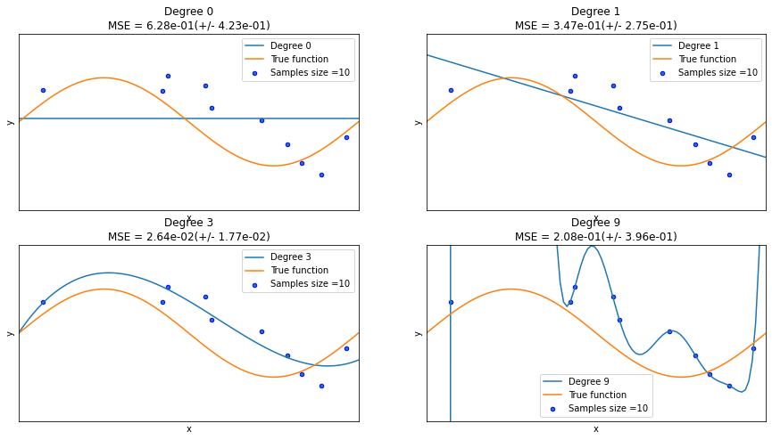
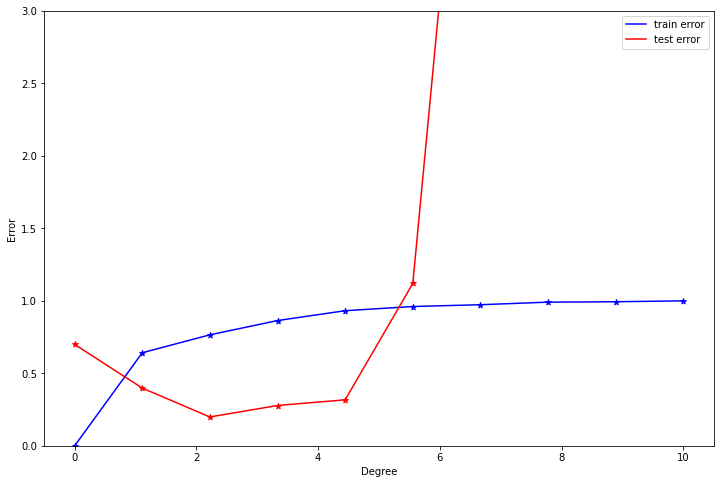
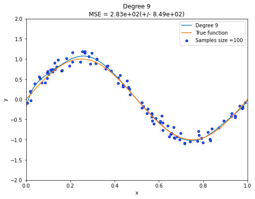
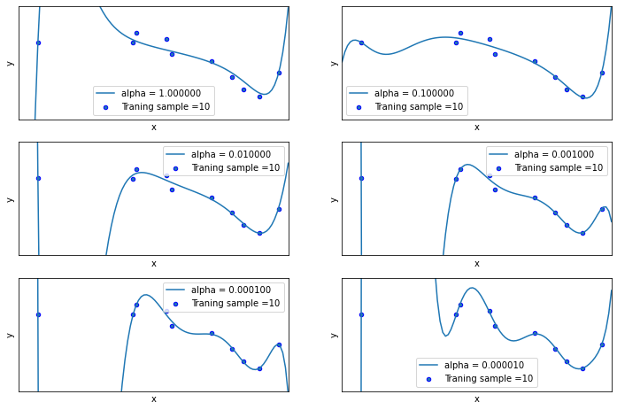
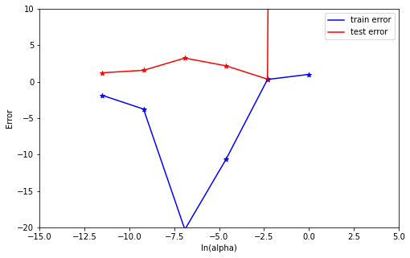
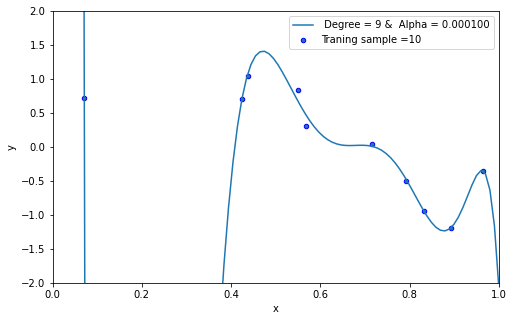

The aim of this project is to demonstrate the problems of underfitting and overfitting. We will also illustrate on how to use linear regression with polynomial features to approximate nonlinear functions. Models with different polynomial features of different degrees will be trained and plotted to determine if any of the fitted models provides a better fit to the randomly generated data. We will perform model evaluation using cross-validation. 

Import libraries

```python
# Libraries
%matplotlib inline
import math
import pandas as pd 
import numpy as np 
import matplotlib.pyplot as plt 
from sklearn.metrics import mean_squared_error, r2_score

from pandas import DataFrame
from sklearn.linear_model import LinearRegression 
from sklearn.linear_model import Ridge
from sklearn.pipeline import Pipeline
from sklearn.pipeline import make_pipeline
from sklearn.preprocessing import PolynomialFeatures
from sklearn.model_selection import cross_val_score
from sklearn.model_selection import train_test_split
from sklearn.metrics import mean_squared_error
from sklearn.preprocessing import StandardScaler
from sklearn.model_selection import learning_curve
from prettytable import PrettyTable
```

Data Structure

1. Generate 20 data pairs (X, Y) using y = sin(2  *pi*  X) + 0.1 * N 
2. X is from uniform distribution between 0 and 1 
3. Sample N from the normal gaussian distribution 
4. Use 10 for train and 10 for test

```python
def true_fun(X):
    return np.sin(2 * np.pi * X)
X = np.sort(np.random.rand(20))
y = true_fun(X) + np.random.randn(20) * 0.1

np.random.seed(0)

dict_data = {
   'X': np.sort(np.random.rand(20)),
   'y': true_fun(X) + np.random.randn(20) * 0.1,
}
data = pd.DataFrame(dict_data)
print(data)
```

```
           X         y
0   0.020218  0.822568
1   0.071036  0.717286
2   0.087129  0.820875
3   0.383442  0.827999
4   0.423655  0.709209
5   0.437587  1.050332
6   0.528895  0.874233
7   0.544883  0.636568
8   0.548814  0.834608
9   0.568045  0.310314
10  0.602763  0.231446
11  0.645894  0.056256
12  0.715189  0.044299
13  0.778157 -0.252640
14  0.791725 -0.503165
15  0.832620 -0.940583
16  0.870012 -1.088743
17  0.891773 -1.193447
18  0.925597 -0.789638
19  0.963663 -0.349965
```

Split data into train and test sets

```python
train_data, test_data = train_test_split(data, test_size=0.5, random_state=25)

print(f"Size of train dat: {train_data.shape[0]}")
print(f"Size of test data: {test_data.shape[0]}")
print(train_data)
```

```
Size of train dat: 10
Size of test data: 10
           X         y
1   0.071036  0.717286
5   0.437587  1.050332
14  0.791725 -0.503165
9   0.568045  0.310314
19  0.963663 -0.349965
17  0.891773 -1.193447
8   0.548814  0.834608
12  0.715189  0.044299
15  0.832620 -0.940583
4   0.423655  0.709209
```

```python
x_train=train_data.iloc[:, 0].values
y_train=train_data.iloc[:, 1].values
x_test=test_data.iloc[:, 0].values
y_test=test_data.iloc[:, 1].values
X_train=x_train[:, np.newaxis] 
X_test=x_test[:, np.newaxis]
```

Using root mean square error, find weights of polynomial regression for order 0, 1, 3, 9.
Gradient descent approach is used to extract weights of the polynomial regression.

```python
# Randomly initialize weights
a = np.random.randn()
b = np.random.randn()
c = np.random.randn()
d = np.random.randn()
e = np.random.randn()
f = np.random.randn()
g = np.random.randn()
h = np.random.randn()
i = np.random.randn()
j = np.random.randn()
a_1 = np.random.randn()
b_1 = np.random.randn()
c_1 = np.random.randn()
d_1 = np.random.randn()
a_2 = np.random.randn()
b_2 = np.random.randn()
a_3 = np.random.randn()


n=len(X_train)
learning_rate = 1e-6
for epoch in range(20000):
    # Forward pass: compute predicted y
    y_pred = a + b * x_train + c * x_train ** 2 + d * x_train ** 3 + e * x_train**4 + f * x_train ** 5 + g * x_train ** 6+ h * x_train**7 + i * x_train ** 8 + j * x_train ** 9
    y_pred_1 = a_1 + b_1 * x_train + c_1 * x_train ** 2 + d_1 * x_train ** 3
    y_pred_2 = a_2 + b_2 * x_train 
    y_pred_3 = a_3
    
    RMSE = np.sqrt((1/n)*sum([val**2 for val in (y_pred-y_train)]))
    RMSE_1 = np.sqrt((1/n)*sum([val_1**2 for val_1 in (y_pred_1-y_train)]))
    RMSE_2 = np.sqrt((1/n)*sum([val_2**2 for val_2 in (y_pred_2-y_train)]))
    RMSE_3 = np.sqrt((1/n)*sum([val_3**2 for val_3 in (y_pred_3-y_train)]))


    # Compute and print loss
    loss = np.square(y_pred - y_train).sum()
    loss_1 = np.square(y_pred_1 - y_train).sum()
    loss_2 = np.square(y_pred_2 - y_train).sum()
    loss_3 = np.square(y_pred_3 - y_train).sum()
    #if epoch % 100 == 99:
        #print(epoch, loss, loss_1, loss_2, loss_3)

    # Backprop to compute gradients with respect to loss
    grad_y_pred = 2.0 * (y_pred - y_train)
    grad_y_pred_1 = 2.0 * (y_pred_1 - y_train)
    grad_y_pred_2 = 2.0 * (y_pred_2 - y_train)
    grad_y_pred_3 = 2.0 * (y_pred_3 - y_train)
    
    grad_a = grad_y_pred.sum()
    grad_b = (grad_y_pred * X_train).sum()
    grad_c = (grad_y_pred * X_train ** 2).sum()
    grad_d = (grad_y_pred * X_train ** 3).sum()
    grad_e = (grad_y_pred * X_train ** 4).sum()
    grad_f = (grad_y_pred * X_train ** 5).sum()
    grad_g = (grad_y_pred * X_train ** 6).sum()
    grad_h = (grad_y_pred * X_train ** 7).sum()
    grad_i = (grad_y_pred * X_train ** 8).sum()
    grad_j = (grad_y_pred * X_train ** 9).sum()
    
    grad_a_1 = grad_y_pred_1.sum()
    grad_b_1 = (grad_y_pred_1 * X_train).sum()
    grad_c_1 = (grad_y_pred_1 * X_train ** 2).sum()
    grad_d_1 = (grad_y_pred_1 * X_train ** 3).sum()
    
    grad_a_2 = grad_y_pred_2.sum()
    grad_b_2 = (grad_y_pred_2 * X_train).sum()
    
    grad_a_3 = grad_y_pred_3.sum()
    
    # Update weights
    a -= learning_rate * grad_a
    b -= learning_rate * grad_b
    c -= learning_rate * grad_c
    d -= learning_rate * grad_d
    e -= learning_rate * grad_a
    f -= learning_rate * grad_b
    g -= learning_rate * grad_c
    h -= learning_rate * grad_d
    i -= learning_rate * grad_a
    j -= learning_rate * grad_b
    
    a_1 -= learning_rate * grad_a_1
    b_1 -= learning_rate * grad_b_1
    c_1 -= learning_rate * grad_c_1
    d_1 -= learning_rate * grad_d_1
    
    a_2 -= learning_rate * grad_a_2
    b_2 -= learning_rate * grad_b_2
    
    a_3 -= learning_rate * grad_a_3
    
    
print(f"RMSE for model with degree 0: {RMSE_3}")
print(f"RMSE for model with degree 1: {RMSE_2}")
print(f"RMSE for model with degree 3: {RMSE_1}")
print(f"RMSE for model with degree 9: {RMSE}")

Rmse_data = {'Degree': [0, 1, 3, 9],
       'RMSE': [RMSE_3, RMSE_2, RMSE_1, RMSE]}          
RMSe = DataFrame(Rmse_data)   # creating DataFrame from dictionary
     

#print(f"New model weight for polynomial with degree 0: {a_3}")
#print(f"New model weight for polynomial with degree 1: {a_2,b_2}")
#print(f"New model weight for polynomial with degree 3: {a_1,b_1,c_1,d_1}")
#print(f"New model weight for polynomial with degree 9: {a,b,c,d,e,f,g,h,i,j}")

model_coeff = {'coefficients': ['W0', 'W1', 'W2', 'W3', 'W4', 'W5', 'W6', 'W7', 'W8', 'W9'],
              'M=0': [a_3, '', '','', '', '','', '', '', ''],
              'M=1': [a_2, b_2, '','', '', '','', '', '', ''],
              'M=3': [a_1, b_1, c_1, d_1, '', '','', '', '',''],
              'M=9': [a, b, c, d, e, f, g, h, i, j]}

Coeff =DataFrame(model_coeff)   

Coeff, RMSe
```

```
RMSE for model with degree 0: 0.840170531158738
RMSE for model with degree 1: 1.0084375550320241
RMSE for model with degree 3: 1.1175458122789657
RMSE for model with degree 9: 0.9170660081592189


(  coefficients      M=0       M=1       M=3       M=9
 0           W0 -0.32002 -0.768894 -1.060352  1.165053
 1           W1           1.177237  1.979129  0.795027
 2           W2                    -0.737246 -0.684510
 3           W3                     0.470855 -0.534040
 4           W4                              -1.113791
 5           W5                              -1.827371
 6           W6                              -2.003453
 7           W7                               1.719038
 8           W8                              -0.574890
 9           W9                              -0.845427,
    Degree      RMSE
 0       0  0.840171
 1       1  1.008438
 2       3  1.117546
 3       9  0.917066)
```

Display charts of fitted data

We can see from the charts below that the constant and the simple linear function (polynomial with degree 0 and 1 respectively) do not provide any good fit to the training samples. This refers to under-fitting. A polynomial of degree 3 approximately follow the true function and maybe considered as a good fit to the data. However, the polynomial of degree 9 over-fit the training data perfectly. The disadvantages of this overfitting is that model tends to perform very poorly on the test data.

```python
degrees = [0, 1, 3, 9]


plt.figure(figsize=(15, 8))
for i in range(len(degrees)):
    ax = plt.subplot(2, len(degrees)/2, i + 1)
    plt.setp(ax, xticks=(), yticks=())

    polynomial_features = PolynomialFeatures(degree=degrees[i], include_bias=True)
    linear_regression = LinearRegression()
    pipeline = Pipeline(
        [
            ("polynomial_features", polynomial_features),
            ("linear_regression", linear_regression),
        ]
    )
    pipeline.fit(x_train[:, np.newaxis], y_train)

    # Evaluate the models using crossvalidation
    scores = cross_val_score(
        pipeline, X[:, np.newaxis], y, scoring="neg_mean_squared_error", cv=10
    )

    X_test = np.linspace(0, 1, 100)
    plt.plot(X_test, pipeline.predict(X_test[:, np.newaxis]), label="Degree %d" % degrees[i])
    plt.plot(X_test, true_fun(X_test), label="True function")
    plt.scatter(x_train, y_train, edgecolor="b", s=20, label="Samples size =10")
    plt.xlabel("x")
    plt.ylabel("y")
    plt.xlim((0, 1))
    plt.ylim((-2, 2))
    plt.legend(loc="best")
    plt.title(
        "Degree {}\nMSE = {:.2e}(+/- {:.2e})".format(
            degrees[i], -scores.mean(), scores.std()
        )
    )
plt.show()
```

```
/var/folders/jt/6555pgf11xv84vcwx1_fqx3r0000gn/T/ipykernel_94867/4034393409.py:6: MatplotlibDeprecationWarning: Passing non-integers as three-element position specification is deprecated since 3.3 and will be removed two minor releases later.
  ax = plt.subplot(2, len(degrees)/2, i + 1)
/var/folders/jt/6555pgf11xv84vcwx1_fqx3r0000gn/T/ipykernel_94867/4034393409.py:6: MatplotlibDeprecationWarning: Passing non-integers as three-element position specification is deprecated since 3.3 and will be removed two minor releases later.
  ax = plt.subplot(2, len(degrees)/2, i + 1)
/var/folders/jt/6555pgf11xv84vcwx1_fqx3r0000gn/T/ipykernel_94867/4034393409.py:6: MatplotlibDeprecationWarning: Passing non-integers as three-element position specification is deprecated since 3.3 and will be removed two minor releases later.
  ax = plt.subplot(2, len(degrees)/2, i + 1)
/var/folders/jt/6555pgf11xv84vcwx1_fqx3r0000gn/T/ipykernel_94867/4034393409.py:6: MatplotlibDeprecationWarning: Passing non-integers as three-element position specification is deprecated since 3.3 and will be removed two minor releases later.
  ax = plt.subplot(2, len(degrees)/2, i + 1)
```



Draw train error vs test error.

The plot below indicates that, the best model for the data is a polynomial of degree 2 or 3. These two models produced the smallest test errors comparatively. As stated earlier, after degree 5, we can observe that overfitting has occurred causing the test errors to jump up significantly. To resolve this, we need to increase the same size.

```python
x_train=train_data.iloc[:, 0].values
y_train=train_data.iloc[:, 1].values
x_test=test_data.iloc[:, 0].values
y_test=test_data.iloc[:, 1].values
X_train=x_train[:, np.newaxis] 
X_test=x_test[:, np.newaxis]
```

```python
train_error =list()   
test_error  =list()   

degrees = [0,1,2,3,4,5,6,7,8,9]
for i in range(len(degrees)):
    polynomial_features = PolynomialFeatures(degree=degrees[i], include_bias=True)
    linear_regression = LinearRegression()
    pipeline = Pipeline(
        [
            ("polynomial_features", polynomial_features),
            ("linear_regression", linear_regression),
        ]
    )
    
    pipeline.fit(X_train, y_train)
    y_predict = pipeline.predict(X_test)
    
    train_score = pipeline.score(X_train, y_train)
    test_score = np.sqrt(mean_squared_error(y_test,y_predict))
    
    train_error = np.append(train_error, train_score)
    test_error  = np.append(test_error, test_score) 
    
print ("train_error= ", train_error, "\n\n") 
print("test_error= ", test_error, "\n") 
```

```
train_error=  [0.         0.64196095 0.76549194 0.86404018 0.9319201  0.9608431
 0.97319402 0.99097783 0.99379993 1.        ] 


test_error=  [6.99332543e-01 3.98052690e-01 1.99001296e-01 2.77973363e-01
 3.17335553e-01 1.12012018e+00 6.05352765e+00 4.69875050e+01
 4.75230242e+01 8.25669865e+02] 
```

```python
degree = np.linspace(0, 10, 10)
plt.figure(figsize=(12, 8))
plt.ylim([0, 3])               #([0, 2.2])   #(-3.1 ,5.2)   #(-10 ,50)  #(-1,2.1)  # (-1,3.7)   
#plt.xlim(0,10)


plt.plot(degree, train_error, label = "train error", color = 'blue')
plt.scatter(degree, train_error,marker='*', color = 'blue')
plt.plot(degree, test_error, label = "test error", color = 'red')
plt.scatter(degree, test_error,marker='*', color = 'red')

plt.xlabel('Degree')
plt.ylabel('Error')
plt.legend()
```

```
<matplotlib.legend.Legend at 0x7fdd09523be0>
```



Now generate 100 more data and fit 9th order model and draw fit.

Increasing the sample size is the best way to resolving overfitting problems. As illustrated below, we can clearly see that the polynomial with degree 9 now provide an excellent fit to the data than before.

```python
def true_fun(X):
    return np.sin(2 * np.pi * X)
np.random.seed(0)
X = np.sort(np.random.rand(100))
y = true_fun(X) + np.random.randn(100) * 0.1

plt.figure(figsize=(8, 6))
polynomial_features = PolynomialFeatures(degree=9, include_bias=True)
linear_regression = LinearRegression()
pipeline = Pipeline(
    [
        ("polynomial_features", polynomial_features),
        ("linear_regression", linear_regression),
    ]
)
pipeline.fit(X[:, np.newaxis], y)


X_test = np.linspace(0, 1, 100)
plt.plot(X_test, pipeline.predict(X_test[:, np.newaxis]), label="Degree %d" % degrees[i])
plt.plot(X_test, true_fun(X_test), label="True function")
plt.scatter(X, y, edgecolor="b", s=20, label="Samples size =100")
plt.xlabel("x")
plt.ylabel("y")
plt.xlim((0, 1))
plt.ylim((-2, 2))
plt.legend(loc="best")
plt.title(
    "Degree {}\nMSE = {:.2e}(+/- {:.2e})".format(
        degrees[i], -scores.mean(), scores.std() 
    )
)
plt.show()
```



Now we will regularize using the sum of weights. Draw chart for lambda is 1, 1/10, 1/100, 1/1000, 1/10000, 1/100000

```python
plt.figure(figsize=(12, 8))

alpha= [ 1, 1/10, 1/100, 1/1000, 1/10000, 1/100000 ]
for i in range(len(alpha)):
    steps = [
    ('scalar', StandardScaler()),
    ('poly', PolynomialFeatures(degree=9)),
    ('model', Ridge(alpha=alpha[i], fit_intercept=True))
    ]

    ridge_pipe = Pipeline(steps)
    ridge_pipe.fit(X_train, y_train)
    y_pred = ridge_pipe.predict(X_test[:, np.newaxis])

    
    ax = plt.subplot(3, 2, i + 1)
    plt.setp(ax, xticks=(), yticks=())
    plt.plot(X_test, y_pred, label="alpha = %.6f" % alpha[i])
    plt.scatter(x_train, y_train, edgecolor='b', s=20, label="Traning sample =10")
    plt.xlabel("x")
    plt.ylabel("y")
    plt.xlim((0, 1))
    plt.ylim((-2, 2))
    plt.legend(loc="best") 
plt.show()
```



Now draw test  and train error according to lamda 

```python
train_error =np.array([])
test_error  =np.array([])

alpha= [ np.log(1), np.log(1/10), np.log(1/100), np.log(1/1000), np.log(1/10000), np.log(1/100000) ]

for i in range(len(alpha)):
    polynomial_features = PolynomialFeatures(degree=9, include_bias=True) 
    Ridg_reg = Ridge(alpha=alpha[i], fit_intercept=True)
    pipeline = Pipeline(
    [
        ("polynomial_features", polynomial_features),
        ("Ridg_reg", Ridg_reg),
    ]
)
    result= pipeline.fit(X_train, y_train).score(X_train, y_train)
    result1= pipeline.score(x_test[:, np.newaxis], y_test)
    y_predict = pipeline.predict(x_test[:, np.newaxis])
    train_error = np.append(train_error, result)
    test_error  = np.append(test_error, np.sqrt(mean_squared_error(y_test,y_predict)) )  #model.score(x_test, y_test))
    
    print ("train_error= ", train_error,"\n\n") 
    print("test_error= ", test_error) 


order = np.linspace(-30, 0, 6)
plt.figure(figsize=(8, 5))
plt.ylim(-20,10)       #(-10 ,50)
plt.xlim(-15,5)

plt.plot(alpha, train_error, label = "train error", color = 'blue')
plt.scatter(alpha, train_error,marker='*', color = 'blue')
plt.plot(alpha, test_error, label = "test error", color = 'red')
plt.scatter(alpha, test_error,marker='*', color = 'red')

plt.xlabel('ln(alpha)')
plt.ylabel('Error')
plt.legend()
```

```
train_error=  [1.] 


test_error=  [825.66986501]
train_error=  [1.         0.30251248] 


test_error=  [8.25669865e+02 3.46986556e-01]
train_error=  [  1.           0.30251248 -10.6213171 ] 


test_error=  [8.25669865e+02 3.46986556e-01 2.17154944e+00]
train_error=  [  1.           0.30251248 -10.6213171  -20.30020319] 


test_error=  [8.25669865e+02 3.46986556e-01 2.17154944e+00 3.23819103e+00]
train_error=  [  1.           0.30251248 -10.6213171  -20.30020319  -3.7656568 ] 


test_error=  [8.25669865e+02 3.46986556e-01 2.17154944e+00 3.23819103e+00
 1.56181635e+00]
train_error=  [  1.           0.30251248 -10.6213171  -20.30020319  -3.7656568
  -1.87232032] 


test_error=  [8.25669865e+02 3.46986556e-01 2.17154944e+00 3.23819103e+00
 1.56181635e+00 1.21680367e+00]


<matplotlib.legend.Legend at 0x7fdd119b1fd0>
```



Based on the best test performance, identify the best model.

The best model is identified by looking at the model with the minimum test error. From the plot above, we can clearly see that the model with alpha=1/10000 produced the lowest test error. Thus the best model is the model with alpha = 1/10000.

```python
steps = [
    ('scalar', StandardScaler()),
    ('poly', PolynomialFeatures(degree=9)),
    ('model', Ridge(alpha=1/10000, fit_intercept=True))
]

ridge_pipe = Pipeline(steps)
ridge_pipe.fit(X_train, y_train)
train_score = ridge_pipe.score(x_train[:, np.newaxis], y_train)
test_score = ridge_pipe.score(x_test[:, np.newaxis], y_test)
y_pred = ridge_pipe.predict(X_test[:, np.newaxis])

print('Training Score: {}'.format(train_score))
print('Test Score: {}'.format(test_score))

plt.figure(figsize=(8, 5))
plt.plot(X_test, y_pred, label=" Degree = 9 &  Alpha = %.6f" %0.000100)
plt.scatter(x_train, y_train, edgecolor='b', s=20, label="Traning sample =10")
plt.xlabel("x")
plt.ylabel("y")
plt.xlim((0, 1))
plt.ylim((-2, 2))
plt.legend(loc="best") 
plt.show()
```

```
Training Score: 0.9908750103483008
Test Score: -16649.105546516905
```



Contributions, Challenges, and Conclusions

In conclusion, the reference codes for this project are taking from the following references. These codes are modified to accomodate the above illustration. I have provided a detail explanations to results in order to gain insighs and facilitate understanding.

References:

1. https://scikit-learn.org/stable/auto_examples/model_selection/plot_underfitting_overfitting.html
2. https://pytorch.org/tutorials/beginner/pytorch_with_examples.html
3. https://scikit-learn.org/stable/index.html
4. Lecture notes on linear models, and overfitting and underfitting