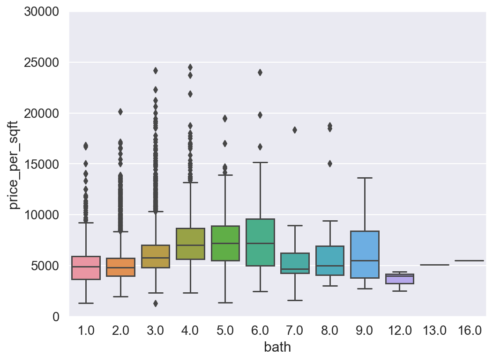

## Introduction

The goal of this project is to train a model that can predict house prices accurately with minimal errors for house buyers and house sellers.

The value of a house is usually determined by several factors which include location, square footage, number of bedroom, number of baths and so on. Due to the recent increase in the price of houses, many seekers of houses are now interested in knowing the very important aspects that give a house its value. In this project, we are interested in modeling the key variables that determine the value of a house and come out with a predictive model that will help home seeker to determine in advance the value of a house. This is a link to the project proposal: 

<https://github.com/Aselisewine/starter-hugo-academic/blob/master/static/uploads/Problem%20Statement%20Proposal.pdf>


## Problem statement

House buyers in the real estate industry always longs to find a reasonable price for the property they wish to buy. Many buyers are also completely at sea about what factors determine the cost of a given house. This has caused to believing that prices of houses in recent times are over-priced. Sellers of houses on the other hand sometimes find it extremely difficult to get a fair price for their property. Many sellers do not even know what factors are to be considered before pricing their property. Since the aim of both buyers and sellers in the real estate industry is to get a fair price for the property they are buying and selling respectively, the goal of this project is to provide a predictive model that can adequately determine the price of a house with minimum margin of error. This will help sellers and buyers to know the fair price of a particular house in advance. This will also help to eliminate the idea of bargaining which sometimes leads to cheating on the other party.

## Methodology

In this project, we are going to train a machine learning model that can predict the price of a house using real estate data in the following link: https://www.kaggle.com/amitabhajoy/bengaluru-house-price-data/activity. The data is made up of 13320 observations or houses sold in India. The response variable in this study is the price of a house. Since the price of a house is a quantitative measured, this is a regression problem and we will train a regression model to predict the prices of homes. The explanatory variable considered in this study are; area type, house availability, house location, house size, society, total square feet, number of bathrooms, and balcony. Variables such as area_type, society, balcony, and availability are droped from the study since they do not contribute much in determining the price of a house. 

Three different models will be fitted to the given data. The best model will be selected based on higher predicted accruacy among the three models. The two models considered in this case are linear regression model, the lasso regression model and the decision trees regression model.

1. Linear Regression

Linear regression is a very simple model that models the linear effects of covariates on the response variable. It generally assumes that the relationship between the response variable and the set of predictors space is linear. The linear regression model is defined as: y = B0 + B1*x1 + B2*x2 +...+ Bp*xp, where B0, B1, ..., Bp are the regression parameters, y is the response variable and x1, ..., xp are the set of predictors space. In this project, y is the price of house, and x will represent the set of predictors spaces.

2. Lasso Regression

The lasso (least absolute shrinkage and selection operator; also Lasso or LASSO) is a regression analysis method that performs both variable selection and regularization in order to enhance the prediction accuracy and interpretability of the resulting statistical model. Lasso was originally formulated for linear regression models. This simple case reveals a substantial amount about the estimator. These include its relationship to ridge regression and best subset selection and the connections between lasso coefficient estimates and so-called soft thresholding. It also reveals that (like standard linear regression) the coefficient estimates do not need to be unique if covariates are collinear.
reference: https://en.wikipedia.org/wiki/Lasso_(statistics)

3. Decision Trees

A decision tree is a flowchart-like structure which is made up of internal nodes and terminal nodels. The termonal nodes are also called the leaf nodes or decision nodes. For regression problems, the final decision node is the average of all observations in the node, whiles for classification problems we choose the class with majority. We are interested in seeing the performances of decision trees in this data because decision can capture both linear and non-linear covariates on the response variable.


## Import libraries

```python
import pandas as pd 
import numpy as np 
import matplotlib
import pickle
import json
import seaborn as sns
import warnings

from matplotlib import pyplot as plt 
from pandas import DataFrame
from sklearn.model_selection import train_test_split
from sklearn.linear_model import LinearRegression 
from sklearn.model_selection import ShuffleSplit 
from sklearn.model_selection import cross_val_score
from sklearn.model_selection import GridSearchCV
from sklearn.linear_model import Lasso
from sklearn.tree import DecisionTreeRegressor
from scipy.stats import skew
from scipy import stats
from scipy.stats.stats import pearsonr
from scipy.stats import norm
from collections import Counter
from sklearn.linear_model import LinearRegression,LassoCV, Ridge, LassoLarsCV,ElasticNetCV
from sklearn.model_selection import GridSearchCV, cross_val_score, learning_curve
from sklearn.preprocessing import StandardScaler, Normalizer, RobustScaler
%matplotlib inline
matplotlib.rcParams["figure.figsize"]=(20,10)

warnings.filterwarnings('ignore')
sns.set(style='white', context='notebook', palette='deep')
%config InlineBackend.figure_format = 'retina' #set 'png' here when working on notebook
```

## Import data set

The data for this project is obtained from the following link: https://www.kaggle.com/amitabhajoy/bengaluru-house-price-data/activity. The data is made up of 13320 observations or houses sold in India. This data has 9 variables namely; area type, house availability, house location, house size, society, total square feet, number of bathrooms, balcony, and the price of the house. The price of the house is going to be the response variable for this project. The data set is going to be divided into two: training set and testing set. The training set will be used to train the model and the testing set will be used to validate the model.

```python
df = pd.read_csv("Bengaluru_House_Data.csv")
df.head()
```

<div>
<style scoped>
    .dataframe tbody tr th:only-of-type {
        vertical-align: middle;
    }

```
.dataframe tbody tr th {
    vertical-align: top;
}

.dataframe thead th {
    text-align: right;
}
```

</style>
<table border="1" class="dataframe">
  <thead>
    <tr style="text-align: right;">
      <th></th>
      <th>area_type</th>
      <th>availability</th>
      <th>location</th>
      <th>size</th>
      <th>society</th>
      <th>total_sqft</th>
      <th>bath</th>
      <th>balcony</th>
      <th>price</th>
    </tr>
  </thead>
  <tbody>
    <tr>
      <th>0</th>
      <td>Super built-up  Area</td>
      <td>19-Dec</td>
      <td>Electronic City Phase II</td>
      <td>2 BHK</td>
      <td>Coomee</td>
      <td>1056</td>
      <td>2.0</td>
      <td>1.0</td>
      <td>39.07</td>
    </tr>
    <tr>
      <th>1</th>
      <td>Plot  Area</td>
      <td>Ready To Move</td>
      <td>Chikka Tirupathi</td>
      <td>4 Bedroom</td>
      <td>Theanmp</td>
      <td>2600</td>
      <td>5.0</td>
      <td>3.0</td>
      <td>120.00</td>
    </tr>
    <tr>
      <th>2</th>
      <td>Built-up  Area</td>
      <td>Ready To Move</td>
      <td>Uttarahalli</td>
      <td>3 BHK</td>
      <td>NaN</td>
      <td>1440</td>
      <td>2.0</td>
      <td>3.0</td>
      <td>62.00</td>
    </tr>
    <tr>
      <th>3</th>
      <td>Super built-up  Area</td>
      <td>Ready To Move</td>
      <td>Lingadheeranahalli</td>
      <td>3 BHK</td>
      <td>Soiewre</td>
      <td>1521</td>
      <td>3.0</td>
      <td>1.0</td>
      <td>95.00</td>
    </tr>
    <tr>
      <th>4</th>
      <td>Super built-up  Area</td>
      <td>Ready To Move</td>
      <td>Kothanur</td>
      <td>2 BHK</td>
      <td>NaN</td>
      <td>1200</td>
      <td>2.0</td>
      <td>1.0</td>
      <td>51.00</td>
    </tr>
  </tbody>
</table>
</div>

```python
df.shape
```

```
(13320, 9)
```

## Data Cleaning

In this section, we carryout data cleaning. The data has many missing values, outliers, and other variables are measured in appropriately. We removed all missing values from the data and we also removed the outliers that were detected from the data. Outliers can have a disproportionate effect on statistical results. So we decided to remove the outliers in order to avoid that. Missing values can also cause bias in the estimation of model parameters, hence we decided to remove them.

```python
df.groupby('area_type')['area_type'].agg('count')
```

```
area_type
Built-up  Area          2418
Carpet  Area              87
Plot  Area              2025
Super built-up  Area    8790
Name: area_type, dtype: int64
```

Predictors such as area_type, society, balcony, and availability are droped since they do not contribute much in determining the value of a house.

```python
df1 = df.drop(['area_type', 'society', 'balcony', 'availability'], axis='columns')
df1.head()
```

<div>
<style scoped>
    .dataframe tbody tr th:only-of-type {
        vertical-align: middle;
    }

```
.dataframe tbody tr th {
    vertical-align: top;
}

.dataframe thead th {
    text-align: right;
}
```

</style>
<table border="1" class="dataframe">
  <thead>
    <tr style="text-align: right;">
      <th></th>
      <th>location</th>
      <th>size</th>
      <th>total_sqft</th>
      <th>bath</th>
      <th>price</th>
    </tr>
  </thead>
  <tbody>
    <tr>
      <th>0</th>
      <td>Electronic City Phase II</td>
      <td>2 BHK</td>
      <td>1056</td>
      <td>2.0</td>
      <td>39.07</td>
    </tr>
    <tr>
      <th>1</th>
      <td>Chikka Tirupathi</td>
      <td>4 Bedroom</td>
      <td>2600</td>
      <td>5.0</td>
      <td>120.00</td>
    </tr>
    <tr>
      <th>2</th>
      <td>Uttarahalli</td>
      <td>3 BHK</td>
      <td>1440</td>
      <td>2.0</td>
      <td>62.00</td>
    </tr>
    <tr>
      <th>3</th>
      <td>Lingadheeranahalli</td>
      <td>3 BHK</td>
      <td>1521</td>
      <td>3.0</td>
      <td>95.00</td>
    </tr>
    <tr>
      <th>4</th>
      <td>Kothanur</td>
      <td>2 BHK</td>
      <td>1200</td>
      <td>2.0</td>
      <td>51.00</td>
    </tr>
  </tbody>
</table>
</div>

The code below checks to find the variables that contain missing values. Location, size and bath all have missing values that need to be removed.

```python
df1.isnull().sum()
```

```
location       1
size          16
total_sqft     0
bath          73
price          0
dtype: int64
```

```python
df2 =df1.dropna()
df2.isnull().sum()
```

```
location      0
size          0
total_sqft    0
bath          0
price         0
dtype: int64
```

We need to convert the values of "size" variable to numeric. The unit of measurement included is not important in the analysis. We will therefore remove them from the data.

```python
df2['size'].unique()
```

```
array(['2 BHK', '4 Bedroom', '3 BHK', '4 BHK', '6 Bedroom', '3 Bedroom',
       '1 BHK', '1 RK', '1 Bedroom', '8 Bedroom', '2 Bedroom',
       '7 Bedroom', '5 BHK', '7 BHK', '6 BHK', '5 Bedroom', '11 BHK',
       '9 BHK', '9 Bedroom', '27 BHK', '10 Bedroom', '11 Bedroom',
       '10 BHK', '19 BHK', '16 BHK', '43 Bedroom', '14 BHK', '8 BHK',
       '12 Bedroom', '13 BHK', '18 Bedroom'], dtype=object)
```

```python
df2['bhk']=df2['size'].apply(lambda x: int(x.split(' ')[0]))
```

```python
df2.head()
```

<div>
<style scoped>
    .dataframe tbody tr th:only-of-type {
        vertical-align: middle;
    }

```
.dataframe tbody tr th {
    vertical-align: top;
}

.dataframe thead th {
    text-align: right;
}
```

</style>
<table border="1" class="dataframe">
  <thead>
    <tr style="text-align: right;">
      <th></th>
      <th>location</th>
      <th>size</th>
      <th>total_sqft</th>
      <th>bath</th>
      <th>price</th>
      <th>bhk</th>
    </tr>
  </thead>
  <tbody>
    <tr>
      <th>0</th>
      <td>Electronic City Phase II</td>
      <td>2 BHK</td>
      <td>1056</td>
      <td>2.0</td>
      <td>39.07</td>
      <td>2</td>
    </tr>
    <tr>
      <th>1</th>
      <td>Chikka Tirupathi</td>
      <td>4 Bedroom</td>
      <td>2600</td>
      <td>5.0</td>
      <td>120.00</td>
      <td>4</td>
    </tr>
    <tr>
      <th>2</th>
      <td>Uttarahalli</td>
      <td>3 BHK</td>
      <td>1440</td>
      <td>2.0</td>
      <td>62.00</td>
      <td>3</td>
    </tr>
    <tr>
      <th>3</th>
      <td>Lingadheeranahalli</td>
      <td>3 BHK</td>
      <td>1521</td>
      <td>3.0</td>
      <td>95.00</td>
      <td>3</td>
    </tr>
    <tr>
      <th>4</th>
      <td>Kothanur</td>
      <td>2 BHK</td>
      <td>1200</td>
      <td>2.0</td>
      <td>51.00</td>
      <td>2</td>
    </tr>
  </tbody>
</table>
</div>

```python
def is_float(x):
    try:
        float(x)
    except:
        return False
    return True
```

```python
df2[~df2['total_sqft'].apply(is_float)].head(10)
```

<div>
<style scoped>
    .dataframe tbody tr th:only-of-type {
        vertical-align: middle;
    }

```
.dataframe tbody tr th {
    vertical-align: top;
}

.dataframe thead th {
    text-align: right;
}
```

</style>
<table border="1" class="dataframe">
  <thead>
    <tr style="text-align: right;">
      <th></th>
      <th>location</th>
      <th>size</th>
      <th>total_sqft</th>
      <th>bath</th>
      <th>price</th>
      <th>bhk</th>
    </tr>
  </thead>
  <tbody>
    <tr>
      <th>30</th>
      <td>Yelahanka</td>
      <td>4 BHK</td>
      <td>2100 - 2850</td>
      <td>4.0</td>
      <td>186.000</td>
      <td>4</td>
    </tr>
    <tr>
      <th>122</th>
      <td>Hebbal</td>
      <td>4 BHK</td>
      <td>3067 - 8156</td>
      <td>4.0</td>
      <td>477.000</td>
      <td>4</td>
    </tr>
    <tr>
      <th>137</th>
      <td>8th Phase JP Nagar</td>
      <td>2 BHK</td>
      <td>1042 - 1105</td>
      <td>2.0</td>
      <td>54.005</td>
      <td>2</td>
    </tr>
    <tr>
      <th>165</th>
      <td>Sarjapur</td>
      <td>2 BHK</td>
      <td>1145 - 1340</td>
      <td>2.0</td>
      <td>43.490</td>
      <td>2</td>
    </tr>
    <tr>
      <th>188</th>
      <td>KR Puram</td>
      <td>2 BHK</td>
      <td>1015 - 1540</td>
      <td>2.0</td>
      <td>56.800</td>
      <td>2</td>
    </tr>
    <tr>
      <th>410</th>
      <td>Kengeri</td>
      <td>1 BHK</td>
      <td>34.46Sq. Meter</td>
      <td>1.0</td>
      <td>18.500</td>
      <td>1</td>
    </tr>
    <tr>
      <th>549</th>
      <td>Hennur Road</td>
      <td>2 BHK</td>
      <td>1195 - 1440</td>
      <td>2.0</td>
      <td>63.770</td>
      <td>2</td>
    </tr>
    <tr>
      <th>648</th>
      <td>Arekere</td>
      <td>9 Bedroom</td>
      <td>4125Perch</td>
      <td>9.0</td>
      <td>265.000</td>
      <td>9</td>
    </tr>
    <tr>
      <th>661</th>
      <td>Yelahanka</td>
      <td>2 BHK</td>
      <td>1120 - 1145</td>
      <td>2.0</td>
      <td>48.130</td>
      <td>2</td>
    </tr>
    <tr>
      <th>672</th>
      <td>Bettahalsoor</td>
      <td>4 Bedroom</td>
      <td>3090 - 5002</td>
      <td>4.0</td>
      <td>445.000</td>
      <td>4</td>
    </tr>
  </tbody>
</table>
</div>

The variable "total square feet" was measured using a range or inerval. We need to convert this by taking the average measurement. We obtained the average by adding the lower and the upper intervals and dividing by 2.

```python
def convert_sqft_to_num(x):
    tokens = x.split('-')
    if len(tokens) == 2:
        return (float(tokens[0])+float(tokens[1]))/2
    try:
        return float(x)
    except:
        return None
```

```python
df3 = df2.copy()
df3['total_sqft'] = df3['total_sqft'].apply(convert_sqft_to_num)
df3.head(3)
```

<div>
<style scoped>
    .dataframe tbody tr th:only-of-type {
        vertical-align: middle;
    }

```
.dataframe tbody tr th {
    vertical-align: top;
}

.dataframe thead th {
    text-align: right;
}
```

</style>
<table border="1" class="dataframe">
  <thead>
    <tr style="text-align: right;">
      <th></th>
      <th>location</th>
      <th>size</th>
      <th>total_sqft</th>
      <th>bath</th>
      <th>price</th>
      <th>bhk</th>
    </tr>
  </thead>
  <tbody>
    <tr>
      <th>0</th>
      <td>Electronic City Phase II</td>
      <td>2 BHK</td>
      <td>1056.0</td>
      <td>2.0</td>
      <td>39.07</td>
      <td>2</td>
    </tr>
    <tr>
      <th>1</th>
      <td>Chikka Tirupathi</td>
      <td>4 Bedroom</td>
      <td>2600.0</td>
      <td>5.0</td>
      <td>120.00</td>
      <td>4</td>
    </tr>
    <tr>
      <th>2</th>
      <td>Uttarahalli</td>
      <td>3 BHK</td>
      <td>1440.0</td>
      <td>2.0</td>
      <td>62.00</td>
      <td>3</td>
    </tr>
  </tbody>
</table>
</div>

```python
df3.loc[30]
```

```
location      Yelahanka
size              4 BHK
total_sqft       2475.0
bath                4.0
price             186.0
bhk                   4
Name: 30, dtype: object
```

We created a new response variable called price per square feet by multiplying price by 100000 and dividing by total square feets. This important because we are interested in finding the value of a given house per total square feet.

```python
df4 = df3.copy()
df4['price_per_sqft'] = df4['price']*100000/df4['total_sqft']
df4.head()
```

<div>
<style scoped>
    .dataframe tbody tr th:only-of-type {
        vertical-align: middle;
    }

```
.dataframe tbody tr th {
    vertical-align: top;
}

.dataframe thead th {
    text-align: right;
}
```

</style>
<table border="1" class="dataframe">
  <thead>
    <tr style="text-align: right;">
      <th></th>
      <th>location</th>
      <th>size</th>
      <th>total_sqft</th>
      <th>bath</th>
      <th>price</th>
      <th>bhk</th>
      <th>price_per_sqft</th>
    </tr>
  </thead>
  <tbody>
    <tr>
      <th>0</th>
      <td>Electronic City Phase II</td>
      <td>2 BHK</td>
      <td>1056.0</td>
      <td>2.0</td>
      <td>39.07</td>
      <td>2</td>
      <td>3699.810606</td>
    </tr>
    <tr>
      <th>1</th>
      <td>Chikka Tirupathi</td>
      <td>4 Bedroom</td>
      <td>2600.0</td>
      <td>5.0</td>
      <td>120.00</td>
      <td>4</td>
      <td>4615.384615</td>
    </tr>
    <tr>
      <th>2</th>
      <td>Uttarahalli</td>
      <td>3 BHK</td>
      <td>1440.0</td>
      <td>2.0</td>
      <td>62.00</td>
      <td>3</td>
      <td>4305.555556</td>
    </tr>
    <tr>
      <th>3</th>
      <td>Lingadheeranahalli</td>
      <td>3 BHK</td>
      <td>1521.0</td>
      <td>3.0</td>
      <td>95.00</td>
      <td>3</td>
      <td>6245.890861</td>
    </tr>
    <tr>
      <th>4</th>
      <td>Kothanur</td>
      <td>2 BHK</td>
      <td>1200.0</td>
      <td>2.0</td>
      <td>51.00</td>
      <td>2</td>
      <td>4250.000000</td>
    </tr>
  </tbody>
</table>
</div>

As seen below, the location variable was measured as a categorical variable. It has a total length of 1293 unique locations. We will try to trim this down a little bit by merging all location that have total count less or equal 10 observations. After merging, we have a total of 242 categories for the location variable.

```python
df4.location = df4.location.apply(lambda x: x.strip())
location_stats = df4.groupby('location')['location'].agg('count').sort_values(ascending=False)
location_stats
```

```
location
Whitefield               535
Sarjapur  Road           392
Electronic City          304
Kanakpura Road           266
Thanisandra              236
                        ... 
1 Giri Nagar               1
Kanakapura Road,           1
Kanakapura main  Road      1
Karnataka Shabarimala      1
whitefiled                 1
Name: location, Length: 1293, dtype: int64
```

```python
len(location_stats[location_stats<=10])
```

```
1052
```

```python
location_stats_less_than_10 = location_stats[location_stats<=10]
location_stats_less_than_10
```

```
location
Basapura                 10
1st Block Koramangala    10
Gunjur Palya             10
Kalkere                  10
Sector 1 HSR Layout      10
                         ..
1 Giri Nagar              1
Kanakapura Road,          1
Kanakapura main  Road     1
Karnataka Shabarimala     1
whitefiled                1
Name: location, Length: 1052, dtype: int64
```

```python
len(df4.location.unique())
```

```
1293
```

```python
df4.location = df4.location.apply(lambda x: 'other' if x in location_stats_less_than_10 else x)
len(df4.location.unique())
```

```
242
```

```python
df4.head(10)
```

<div>
<style scoped>
    .dataframe tbody tr th:only-of-type {
        vertical-align: middle;
    }

```
.dataframe tbody tr th {
    vertical-align: top;
}

.dataframe thead th {
    text-align: right;
}
```

</style>
<table border="1" class="dataframe">
  <thead>
    <tr style="text-align: right;">
      <th></th>
      <th>location</th>
      <th>size</th>
      <th>total_sqft</th>
      <th>bath</th>
      <th>price</th>
      <th>bhk</th>
      <th>price_per_sqft</th>
    </tr>
  </thead>
  <tbody>
    <tr>
      <th>0</th>
      <td>Electronic City Phase II</td>
      <td>2 BHK</td>
      <td>1056.0</td>
      <td>2.0</td>
      <td>39.07</td>
      <td>2</td>
      <td>3699.810606</td>
    </tr>
    <tr>
      <th>1</th>
      <td>Chikka Tirupathi</td>
      <td>4 Bedroom</td>
      <td>2600.0</td>
      <td>5.0</td>
      <td>120.00</td>
      <td>4</td>
      <td>4615.384615</td>
    </tr>
    <tr>
      <th>2</th>
      <td>Uttarahalli</td>
      <td>3 BHK</td>
      <td>1440.0</td>
      <td>2.0</td>
      <td>62.00</td>
      <td>3</td>
      <td>4305.555556</td>
    </tr>
    <tr>
      <th>3</th>
      <td>Lingadheeranahalli</td>
      <td>3 BHK</td>
      <td>1521.0</td>
      <td>3.0</td>
      <td>95.00</td>
      <td>3</td>
      <td>6245.890861</td>
    </tr>
    <tr>
      <th>4</th>
      <td>Kothanur</td>
      <td>2 BHK</td>
      <td>1200.0</td>
      <td>2.0</td>
      <td>51.00</td>
      <td>2</td>
      <td>4250.000000</td>
    </tr>
    <tr>
      <th>5</th>
      <td>Whitefield</td>
      <td>2 BHK</td>
      <td>1170.0</td>
      <td>2.0</td>
      <td>38.00</td>
      <td>2</td>
      <td>3247.863248</td>
    </tr>
    <tr>
      <th>6</th>
      <td>Old Airport Road</td>
      <td>4 BHK</td>
      <td>2732.0</td>
      <td>4.0</td>
      <td>204.00</td>
      <td>4</td>
      <td>7467.057101</td>
    </tr>
    <tr>
      <th>7</th>
      <td>Rajaji Nagar</td>
      <td>4 BHK</td>
      <td>3300.0</td>
      <td>4.0</td>
      <td>600.00</td>
      <td>4</td>
      <td>18181.818182</td>
    </tr>
    <tr>
      <th>8</th>
      <td>Marathahalli</td>
      <td>3 BHK</td>
      <td>1310.0</td>
      <td>3.0</td>
      <td>63.25</td>
      <td>3</td>
      <td>4828.244275</td>
    </tr>
    <tr>
      <th>9</th>
      <td>other</td>
      <td>6 Bedroom</td>
      <td>1020.0</td>
      <td>6.0</td>
      <td>370.00</td>
      <td>6</td>
      <td>36274.509804</td>
    </tr>
  </tbody>
</table>
</div>

```python
df4[df4.total_sqft/df4.bhk<300].head()
```

<div>
<style scoped>
    .dataframe tbody tr th:only-of-type {
        vertical-align: middle;
    }

```
.dataframe tbody tr th {
    vertical-align: top;
}

.dataframe thead th {
    text-align: right;
}
```

</style>
<table border="1" class="dataframe">
  <thead>
    <tr style="text-align: right;">
      <th></th>
      <th>location</th>
      <th>size</th>
      <th>total_sqft</th>
      <th>bath</th>
      <th>price</th>
      <th>bhk</th>
      <th>price_per_sqft</th>
    </tr>
  </thead>
  <tbody>
    <tr>
      <th>9</th>
      <td>other</td>
      <td>6 Bedroom</td>
      <td>1020.0</td>
      <td>6.0</td>
      <td>370.0</td>
      <td>6</td>
      <td>36274.509804</td>
    </tr>
    <tr>
      <th>45</th>
      <td>HSR Layout</td>
      <td>8 Bedroom</td>
      <td>600.0</td>
      <td>9.0</td>
      <td>200.0</td>
      <td>8</td>
      <td>33333.333333</td>
    </tr>
    <tr>
      <th>58</th>
      <td>Murugeshpalya</td>
      <td>6 Bedroom</td>
      <td>1407.0</td>
      <td>4.0</td>
      <td>150.0</td>
      <td>6</td>
      <td>10660.980810</td>
    </tr>
    <tr>
      <th>68</th>
      <td>Devarachikkanahalli</td>
      <td>8 Bedroom</td>
      <td>1350.0</td>
      <td>7.0</td>
      <td>85.0</td>
      <td>8</td>
      <td>6296.296296</td>
    </tr>
    <tr>
      <th>70</th>
      <td>other</td>
      <td>3 Bedroom</td>
      <td>500.0</td>
      <td>3.0</td>
      <td>100.0</td>
      <td>3</td>
      <td>20000.000000</td>
    </tr>
  </tbody>
</table>
</div>

```python
df4.shape
```

```
(13246, 7)
```

## Exploratory Analysis

In this section carried out a data exploratory analysis. We plotted correlation hearmaps, box-plots, histogram, and scatter plots. The rational for doing this is to know the distribution of our dataset and also to help us identify outliers. From the correlation heatmap, we can observe that none of the predictors are highly correlated with each other. Also, using the box-plot, we can observe that the variable "bath" have many upper extreme outliers. Similar observation are found on the variable "bhk". The probability plot for the response variable indicates a total deviation from normality. We will transform the dependent variable using the natural logarithms function in order to attain normality which is a requirement regression. Outliers in the data will also be removed. After performing transformation and removing the outliers, the results of the normality plot clearly shows the response variable is normally distributed.

```python
df5 = df4[~(df4.total_sqft/df4.bhk<300)]
df5.shape
```

```
(12502, 7)
```

```python
df5.price_per_sqft.describe()
```

```
count     12456.000000
mean       6308.502826
std        4168.127339
min         267.829813
25%        4210.526316
50%        5294.117647
75%        6916.666667
max      176470.588235
Name: price_per_sqft, dtype: float64
```

```python
def remove_pps_outliers(df):
    df_out = pd.DataFrame()
    for key, subdf in df.groupby('location'):
        m = np.mean(subdf.price_per_sqft)
        st = np.std(subdf.price_per_sqft)
        reduced_df = subdf[(subdf.price_per_sqft>(m-st)) & (subdf.price_per_sqft<=(m+st))]
        df_out = pd.concat([df_out, reduced_df], ignore_index=True)
    return df_out
df6 = remove_pps_outliers(df5)
df6.shape
```

```
(10241, 7)
```

```python
sns.distplot(df6['price_per_sqft'] , fit=norm);


(mu, sigma) = norm.fit(df6['price_per_sqft'])
print( '\n mu = {:.2f} and sigma = {:.2f}\n'.format(mu, sigma))
plt.legend(['Normal dist. ($\mu=$ {:.2f} and $\sigma=$ {:.2f} )'.format(mu, sigma)],
            loc='best')
plt.ylabel('Frequency')
plt.title('price_per_sqft distribution')

fig = plt.figure()
res = stats.probplot(df6['price_per_sqft'], plot=plt)
plt.show()

print("Skewness: %f" % df6['price_per_sqft'].skew())
print("Kurtosis: %f" % df6['price_per_sqft'].kurt())
```

```
 mu = 5657.70 and sigma = 2266.37
```


```
Skewness: 2.193118
Kurtosis: 7.824979
```

```python
# Correlation Matrix Heatmap
corrmat = df6.corr()
f, ax = plt.subplots(figsize=(12, 9))
sns.heatmap(corrmat, vmax=.8, square=True);
```


```python
# Top 5 Heatmap
k = 5 
cols = corrmat.nlargest(k, 'price_per_sqft')['price_per_sqft'].index
cm = np.corrcoef(df6[cols].values.T)
sns.set(font_scale=1.25)
hm = sns.heatmap(cm, cbar=True, annot=True, square=True, fmt='.2f', annot_kws={'size': 10}, yticklabels=cols.values, xticklabels=cols.values)
plt.show()
```


```python
var = 'bath'
data = pd.concat([df6['price_per_sqft'], df6[var]], axis=1)
f, ax = plt.subplots(figsize=(8, 6))
fig = sns.boxplot(x=var, y="price_per_sqft", data=data)
fig.axis(ymin=0, ymax=30000);
```



```python
var = 'bhk'
data = pd.concat([df6['price_per_sqft'], df6[var]], axis=1)
f, ax = plt.subplots(figsize=(8, 6))
fig = sns.boxplot(x=var, y="price_per_sqft", data=data)
fig.axis(ymin=0, ymax=30000);
```


```python
def plot_scatter_chart(df,location):
    bhk2 = df[(df.location==location) & (df.bhk==2)]
    bhk3 = df[(df.location==location) & (df.bhk==3)]
    matplotlib.rcParams['figure.figsize'] = (15, 10)
    plt.scatter(bhk2.total_sqft, bhk2.price_per_sqft, color = 'blue', label = '2 BHK', s=50)
    plt.scatter(bhk3.total_sqft, bhk3.price_per_sqft,marker='+', color = 'green', label = '3 BHK', s=50)
    plt.xlabel("Total Square Feet Area")
    plt.xlabel("Price Per Square Feet")
    plt.title(location)
    plt.legend()
    
plot_scatter_chart(df6,"Rajaji Nagar")
```


```python
def plot_scatter_chart(df,location):
    bhk2 = df[(df.location==location) & (df.bhk==2)]
    bhk3 = df[(df.location==location) & (df.bhk==3)]
    matplotlib.rcParams['figure.figsize'] = (15, 10)
    plt.scatter(bhk2.total_sqft, bhk2.price, color = 'blue', label = '2 BHK', s=50)
    plt.scatter(bhk3.total_sqft, bhk3.price,marker='+', color = 'green', label = '3 BHK', s=50)
    plt.xlabel("Total Square Feet Area")
    plt.xlabel("Price Per Square Feet")
    plt.title(location)
    plt.legend()
    
plot_scatter_chart(df6,"Hebbal")
```


```python
def remove_bhk_outliers(df):
    exclude_indices = np.array([])
    for location, location_df in df.groupby('location'):
        bhk_stats = {}
        for bhk, bhk_df in location_df.groupby('bhk'):
            bhk_stats[bhk] = {
                'mean': np.mean(bhk_df.price_per_sqft),
                'std': np.std(bhk_df.price_per_sqft),
                'count': bhk_df.shape[0]
            }
        for bhk, bhk_df in location_df.groupby('bhk'):
            stats = bhk_stats.get(bhk-1)
            if stats and stats['count']>5:
                exclude_indices = np.append(exclude_indices, bhk_df[bhk_df.price_per_sqft<(stats['mean'])].index.values)
    return df.drop(exclude_indices,axis='index')

df7 = remove_bhk_outliers(df6)
df7.shape
```

```
(7329, 7)
```

```python
plot_scatter_chart(df7,"Hebbal")
```


```python
matplotlib.rcParams['figure.figsize'] = (20, 10)
plt.hist(df7.price_per_sqft, rwidth=0.8)
plt.xlabel("Price Per Square Feet")
plt.ylabel("count")
```

```
Text(0, 0.5, 'count')
```


```python
df7.bath.unique()
```

```
array([ 4.,  3.,  2.,  5.,  8.,  1.,  6.,  7.,  9., 12., 16., 13.])
```

```python
df7[df7.bath>10]
```

<div>
<style scoped>
    .dataframe tbody tr th:only-of-type {
        vertical-align: middle;
    }

```
.dataframe tbody tr th {
    vertical-align: top;
}

.dataframe thead th {
    text-align: right;
}
```

</style>
<table border="1" class="dataframe">
  <thead>
    <tr style="text-align: right;">
      <th></th>
      <th>location</th>
      <th>size</th>
      <th>total_sqft</th>
      <th>bath</th>
      <th>price</th>
      <th>bhk</th>
      <th>price_per_sqft</th>
    </tr>
  </thead>
  <tbody>
    <tr>
      <th>5277</th>
      <td>Neeladri Nagar</td>
      <td>10 BHK</td>
      <td>4000.0</td>
      <td>12.0</td>
      <td>160.0</td>
      <td>10</td>
      <td>4000.000000</td>
    </tr>
    <tr>
      <th>8486</th>
      <td>other</td>
      <td>10 BHK</td>
      <td>12000.0</td>
      <td>12.0</td>
      <td>525.0</td>
      <td>10</td>
      <td>4375.000000</td>
    </tr>
    <tr>
      <th>8575</th>
      <td>other</td>
      <td>16 BHK</td>
      <td>10000.0</td>
      <td>16.0</td>
      <td>550.0</td>
      <td>16</td>
      <td>5500.000000</td>
    </tr>
    <tr>
      <th>9308</th>
      <td>other</td>
      <td>11 BHK</td>
      <td>6000.0</td>
      <td>12.0</td>
      <td>150.0</td>
      <td>11</td>
      <td>2500.000000</td>
    </tr>
    <tr>
      <th>9639</th>
      <td>other</td>
      <td>13 BHK</td>
      <td>5425.0</td>
      <td>13.0</td>
      <td>275.0</td>
      <td>13</td>
      <td>5069.124424</td>
    </tr>
  </tbody>
</table>
</div>

```python
plt.hist(df7.bath, rwidth=0.8)
plt.xlabel("Number of bathrooms")
plt.ylabel("Count")
```

```
Text(0, 0.5, 'Count')
```


```python
df7[df7.bath>df7.bhk+2]
```

<div>
<style scoped>
    .dataframe tbody tr th:only-of-type {
        vertical-align: middle;
    }

```
.dataframe tbody tr th {
    vertical-align: top;
}

.dataframe thead th {
    text-align: right;
}
```

</style>
<table border="1" class="dataframe">
  <thead>
    <tr style="text-align: right;">
      <th></th>
      <th>location</th>
      <th>size</th>
      <th>total_sqft</th>
      <th>bath</th>
      <th>price</th>
      <th>bhk</th>
      <th>price_per_sqft</th>
    </tr>
  </thead>
  <tbody>
    <tr>
      <th>1626</th>
      <td>Chikkabanavar</td>
      <td>4 Bedroom</td>
      <td>2460.0</td>
      <td>7.0</td>
      <td>80.0</td>
      <td>4</td>
      <td>3252.032520</td>
    </tr>
    <tr>
      <th>5238</th>
      <td>Nagasandra</td>
      <td>4 Bedroom</td>
      <td>7000.0</td>
      <td>8.0</td>
      <td>450.0</td>
      <td>4</td>
      <td>6428.571429</td>
    </tr>
    <tr>
      <th>6711</th>
      <td>Thanisandra</td>
      <td>3 BHK</td>
      <td>1806.0</td>
      <td>6.0</td>
      <td>116.0</td>
      <td>3</td>
      <td>6423.034330</td>
    </tr>
    <tr>
      <th>8411</th>
      <td>other</td>
      <td>6 BHK</td>
      <td>11338.0</td>
      <td>9.0</td>
      <td>1000.0</td>
      <td>6</td>
      <td>8819.897689</td>
    </tr>
  </tbody>
</table>
</div>

```python
df7["price_per_sqft"] = np.log1p(df7["price_per_sqft"])


sns.distplot(df7['price_per_sqft'] , fit=norm);


(mu, sigma) = norm.fit(df7['price_per_sqft'])
print( '\n mu = {:.2f} and sigma = {:.2f}\n'.format(mu, sigma))
plt.legend(['Normal dist. ($\mu=$ {:.2f} and $\sigma=$ {:.2f} )'.format(mu, sigma)],
            loc='best')
plt.ylabel('Frequency')
plt.title('price_per_sqft distribution')

fig = plt.figure()
res = stats.probplot(df7['price_per_sqft'], plot=plt)
plt.show()

y_train = df7.price_per_sqft.values

print("Skewness: %f" % df7['price_per_sqft'].skew())
print("Kurtosis: %f" % df7['price_per_sqft'].kurt())
```

```
 mu = 8.66 and sigma = 0.35
```


```
Skewness: 0.436604
Kurtosis: 0.838200
```

```python
df8=df7[df7.bath<df7.bhk+2]
df8.shape
```

```
(7251, 7)
```

```python
df9=df8.drop(['size', 'price_per_sqft'], axis='columns')
df9.head(3)
```

<div>
<style scoped>
    .dataframe tbody tr th:only-of-type {
        vertical-align: middle;
    }

```
.dataframe tbody tr th {
    vertical-align: top;
}

.dataframe thead th {
    text-align: right;
}
```

</style>
<table border="1" class="dataframe">
  <thead>
    <tr style="text-align: right;">
      <th></th>
      <th>location</th>
      <th>total_sqft</th>
      <th>bath</th>
      <th>price</th>
      <th>bhk</th>
    </tr>
  </thead>
  <tbody>
    <tr>
      <th>0</th>
      <td>1st Block Jayanagar</td>
      <td>2850.0</td>
      <td>4.0</td>
      <td>428.0</td>
      <td>4</td>
    </tr>
    <tr>
      <th>1</th>
      <td>1st Block Jayanagar</td>
      <td>1630.0</td>
      <td>3.0</td>
      <td>194.0</td>
      <td>3</td>
    </tr>
    <tr>
      <th>2</th>
      <td>1st Block Jayanagar</td>
      <td>1875.0</td>
      <td>2.0</td>
      <td>235.0</td>
      <td>3</td>
    </tr>
  </tbody>
</table>
</div>

```python
dummies = pd.get_dummies(df9.location)
dummies.head(3)
```

<div>
<style scoped>
    .dataframe tbody tr th:only-of-type {
        vertical-align: middle;
    }

```
.dataframe tbody tr th {
    vertical-align: top;
}

.dataframe thead th {
    text-align: right;
}
```

</style>
<table border="1" class="dataframe">
  <thead>
    <tr style="text-align: right;">
      <th></th>
      <th>1st Block Jayanagar</th>
      <th>1st Phase JP Nagar</th>
      <th>2nd Phase Judicial Layout</th>
      <th>2nd Stage Nagarbhavi</th>
      <th>5th Block Hbr Layout</th>
      <th>5th Phase JP Nagar</th>
      <th>6th Phase JP Nagar</th>
      <th>7th Phase JP Nagar</th>
      <th>8th Phase JP Nagar</th>
      <th>9th Phase JP Nagar</th>
      <th>...</th>
      <th>Vishveshwarya Layout</th>
      <th>Vishwapriya Layout</th>
      <th>Vittasandra</th>
      <th>Whitefield</th>
      <th>Yelachenahalli</th>
      <th>Yelahanka</th>
      <th>Yelahanka New Town</th>
      <th>Yelenahalli</th>
      <th>Yeshwanthpur</th>
      <th>other</th>
    </tr>
  </thead>
  <tbody>
    <tr>
      <th>0</th>
      <td>1</td>
      <td>0</td>
      <td>0</td>
      <td>0</td>
      <td>0</td>
      <td>0</td>
      <td>0</td>
      <td>0</td>
      <td>0</td>
      <td>0</td>
      <td>...</td>
      <td>0</td>
      <td>0</td>
      <td>0</td>
      <td>0</td>
      <td>0</td>
      <td>0</td>
      <td>0</td>
      <td>0</td>
      <td>0</td>
      <td>0</td>
    </tr>
    <tr>
      <th>1</th>
      <td>1</td>
      <td>0</td>
      <td>0</td>
      <td>0</td>
      <td>0</td>
      <td>0</td>
      <td>0</td>
      <td>0</td>
      <td>0</td>
      <td>0</td>
      <td>...</td>
      <td>0</td>
      <td>0</td>
      <td>0</td>
      <td>0</td>
      <td>0</td>
      <td>0</td>
      <td>0</td>
      <td>0</td>
      <td>0</td>
      <td>0</td>
    </tr>
    <tr>
      <th>2</th>
      <td>1</td>
      <td>0</td>
      <td>0</td>
      <td>0</td>
      <td>0</td>
      <td>0</td>
      <td>0</td>
      <td>0</td>
      <td>0</td>
      <td>0</td>
      <td>...</td>
      <td>0</td>
      <td>0</td>
      <td>0</td>
      <td>0</td>
      <td>0</td>
      <td>0</td>
      <td>0</td>
      <td>0</td>
      <td>0</td>
      <td>0</td>
    </tr>
  </tbody>
</table>
<p>3 rows × 242 columns</p>
</div>

```python
df10 = pd.concat([df9, dummies.drop('other', axis='columns')], axis = 'columns')
df10.head(3)
```

<div>
<style scoped>
    .dataframe tbody tr th:only-of-type {
        vertical-align: middle;
    }

```
.dataframe tbody tr th {
    vertical-align: top;
}

.dataframe thead th {
    text-align: right;
}
```

</style>
<table border="1" class="dataframe">
  <thead>
    <tr style="text-align: right;">
      <th></th>
      <th>location</th>
      <th>total_sqft</th>
      <th>bath</th>
      <th>price</th>
      <th>bhk</th>
      <th>1st Block Jayanagar</th>
      <th>1st Phase JP Nagar</th>
      <th>2nd Phase Judicial Layout</th>
      <th>2nd Stage Nagarbhavi</th>
      <th>5th Block Hbr Layout</th>
      <th>...</th>
      <th>Vijayanagar</th>
      <th>Vishveshwarya Layout</th>
      <th>Vishwapriya Layout</th>
      <th>Vittasandra</th>
      <th>Whitefield</th>
      <th>Yelachenahalli</th>
      <th>Yelahanka</th>
      <th>Yelahanka New Town</th>
      <th>Yelenahalli</th>
      <th>Yeshwanthpur</th>
    </tr>
  </thead>
  <tbody>
    <tr>
      <th>0</th>
      <td>1st Block Jayanagar</td>
      <td>2850.0</td>
      <td>4.0</td>
      <td>428.0</td>
      <td>4</td>
      <td>1</td>
      <td>0</td>
      <td>0</td>
      <td>0</td>
      <td>0</td>
      <td>...</td>
      <td>0</td>
      <td>0</td>
      <td>0</td>
      <td>0</td>
      <td>0</td>
      <td>0</td>
      <td>0</td>
      <td>0</td>
      <td>0</td>
      <td>0</td>
    </tr>
    <tr>
      <th>1</th>
      <td>1st Block Jayanagar</td>
      <td>1630.0</td>
      <td>3.0</td>
      <td>194.0</td>
      <td>3</td>
      <td>1</td>
      <td>0</td>
      <td>0</td>
      <td>0</td>
      <td>0</td>
      <td>...</td>
      <td>0</td>
      <td>0</td>
      <td>0</td>
      <td>0</td>
      <td>0</td>
      <td>0</td>
      <td>0</td>
      <td>0</td>
      <td>0</td>
      <td>0</td>
    </tr>
    <tr>
      <th>2</th>
      <td>1st Block Jayanagar</td>
      <td>1875.0</td>
      <td>2.0</td>
      <td>235.0</td>
      <td>3</td>
      <td>1</td>
      <td>0</td>
      <td>0</td>
      <td>0</td>
      <td>0</td>
      <td>...</td>
      <td>0</td>
      <td>0</td>
      <td>0</td>
      <td>0</td>
      <td>0</td>
      <td>0</td>
      <td>0</td>
      <td>0</td>
      <td>0</td>
      <td>0</td>
    </tr>
  </tbody>
</table>
<p>3 rows × 246 columns</p>
</div>

```python
df11 = df10.drop('location',axis = 'columns')
df11.head(2)
```

<div>
<style scoped>
    .dataframe tbody tr th:only-of-type {
        vertical-align: middle;
    }

```
.dataframe tbody tr th {
    vertical-align: top;
}

.dataframe thead th {
    text-align: right;
}
```

</style>
<table border="1" class="dataframe">
  <thead>
    <tr style="text-align: right;">
      <th></th>
      <th>total_sqft</th>
      <th>bath</th>
      <th>price</th>
      <th>bhk</th>
      <th>1st Block Jayanagar</th>
      <th>1st Phase JP Nagar</th>
      <th>2nd Phase Judicial Layout</th>
      <th>2nd Stage Nagarbhavi</th>
      <th>5th Block Hbr Layout</th>
      <th>5th Phase JP Nagar</th>
      <th>...</th>
      <th>Vijayanagar</th>
      <th>Vishveshwarya Layout</th>
      <th>Vishwapriya Layout</th>
      <th>Vittasandra</th>
      <th>Whitefield</th>
      <th>Yelachenahalli</th>
      <th>Yelahanka</th>
      <th>Yelahanka New Town</th>
      <th>Yelenahalli</th>
      <th>Yeshwanthpur</th>
    </tr>
  </thead>
  <tbody>
    <tr>
      <th>0</th>
      <td>2850.0</td>
      <td>4.0</td>
      <td>428.0</td>
      <td>4</td>
      <td>1</td>
      <td>0</td>
      <td>0</td>
      <td>0</td>
      <td>0</td>
      <td>0</td>
      <td>...</td>
      <td>0</td>
      <td>0</td>
      <td>0</td>
      <td>0</td>
      <td>0</td>
      <td>0</td>
      <td>0</td>
      <td>0</td>
      <td>0</td>
      <td>0</td>
    </tr>
    <tr>
      <th>1</th>
      <td>1630.0</td>
      <td>3.0</td>
      <td>194.0</td>
      <td>3</td>
      <td>1</td>
      <td>0</td>
      <td>0</td>
      <td>0</td>
      <td>0</td>
      <td>0</td>
      <td>...</td>
      <td>0</td>
      <td>0</td>
      <td>0</td>
      <td>0</td>
      <td>0</td>
      <td>0</td>
      <td>0</td>
      <td>0</td>
      <td>0</td>
      <td>0</td>
    </tr>
  </tbody>
</table>
<p>2 rows × 245 columns</p>
</div>

```python
df11.shape
```

```
(7251, 245)
```

```python
X = df11.drop('price', axis = 'columns')
X.head()
```

<div>
<style scoped>
    .dataframe tbody tr th:only-of-type {
        vertical-align: middle;
    }

```
.dataframe tbody tr th {
    vertical-align: top;
}

.dataframe thead th {
    text-align: right;
}
```

</style>
<table border="1" class="dataframe">
  <thead>
    <tr style="text-align: right;">
      <th></th>
      <th>total_sqft</th>
      <th>bath</th>
      <th>bhk</th>
      <th>1st Block Jayanagar</th>
      <th>1st Phase JP Nagar</th>
      <th>2nd Phase Judicial Layout</th>
      <th>2nd Stage Nagarbhavi</th>
      <th>5th Block Hbr Layout</th>
      <th>5th Phase JP Nagar</th>
      <th>6th Phase JP Nagar</th>
      <th>...</th>
      <th>Vijayanagar</th>
      <th>Vishveshwarya Layout</th>
      <th>Vishwapriya Layout</th>
      <th>Vittasandra</th>
      <th>Whitefield</th>
      <th>Yelachenahalli</th>
      <th>Yelahanka</th>
      <th>Yelahanka New Town</th>
      <th>Yelenahalli</th>
      <th>Yeshwanthpur</th>
    </tr>
  </thead>
  <tbody>
    <tr>
      <th>0</th>
      <td>2850.0</td>
      <td>4.0</td>
      <td>4</td>
      <td>1</td>
      <td>0</td>
      <td>0</td>
      <td>0</td>
      <td>0</td>
      <td>0</td>
      <td>0</td>
      <td>...</td>
      <td>0</td>
      <td>0</td>
      <td>0</td>
      <td>0</td>
      <td>0</td>
      <td>0</td>
      <td>0</td>
      <td>0</td>
      <td>0</td>
      <td>0</td>
    </tr>
    <tr>
      <th>1</th>
      <td>1630.0</td>
      <td>3.0</td>
      <td>3</td>
      <td>1</td>
      <td>0</td>
      <td>0</td>
      <td>0</td>
      <td>0</td>
      <td>0</td>
      <td>0</td>
      <td>...</td>
      <td>0</td>
      <td>0</td>
      <td>0</td>
      <td>0</td>
      <td>0</td>
      <td>0</td>
      <td>0</td>
      <td>0</td>
      <td>0</td>
      <td>0</td>
    </tr>
    <tr>
      <th>2</th>
      <td>1875.0</td>
      <td>2.0</td>
      <td>3</td>
      <td>1</td>
      <td>0</td>
      <td>0</td>
      <td>0</td>
      <td>0</td>
      <td>0</td>
      <td>0</td>
      <td>...</td>
      <td>0</td>
      <td>0</td>
      <td>0</td>
      <td>0</td>
      <td>0</td>
      <td>0</td>
      <td>0</td>
      <td>0</td>
      <td>0</td>
      <td>0</td>
    </tr>
    <tr>
      <th>3</th>
      <td>1200.0</td>
      <td>2.0</td>
      <td>3</td>
      <td>1</td>
      <td>0</td>
      <td>0</td>
      <td>0</td>
      <td>0</td>
      <td>0</td>
      <td>0</td>
      <td>...</td>
      <td>0</td>
      <td>0</td>
      <td>0</td>
      <td>0</td>
      <td>0</td>
      <td>0</td>
      <td>0</td>
      <td>0</td>
      <td>0</td>
      <td>0</td>
    </tr>
    <tr>
      <th>4</th>
      <td>1235.0</td>
      <td>2.0</td>
      <td>2</td>
      <td>1</td>
      <td>0</td>
      <td>0</td>
      <td>0</td>
      <td>0</td>
      <td>0</td>
      <td>0</td>
      <td>...</td>
      <td>0</td>
      <td>0</td>
      <td>0</td>
      <td>0</td>
      <td>0</td>
      <td>0</td>
      <td>0</td>
      <td>0</td>
      <td>0</td>
      <td>0</td>
    </tr>
  </tbody>
</table>
<p>5 rows × 244 columns</p>
</div>

```python
y = df11.price
y.head()
```

```
0    428.0
1    194.0
2    235.0
3    130.0
4    148.0
Name: price, dtype: float64
```

## Spliting data set in to training and testing set.

80% of the total data set is using to train the regression model whiles 20% of the data is used to validate the model

```python
X_train, X_test, y_train, y_test = train_test_split(X,y, test_size=0.2, random_state=10)
```

## Model fitting

The main goal of this project is to find the best predictive model for our dataset. We have decided to perform some initial model screening process by fitting the following models below to enable us select the candidate models for comparisons. A preliminary search suggest that the multiple linear regression model, the random forest regresion model and the decision trees regression model are good candidates to consider in the next stage. Linear regression has an accuracy rate of 84.5%, which is the highest, follow by random forest with an accuracy rate of about 79%, and lastly, the decision tree model with an accuracy of 70.9%. We will considered these three models in addition to the Lasso regression model in the final fitting stage. We are also interested in exploring the Lasso regression because of it's ability to perform variable selections.

```python
from sklearn.svm import SVR
regressor1 = SVR(kernel = 'rbf')
regressor1.fit(X_train,y_train)
regressor1.score(X_test,y_test)
```

```
0.6450869012513898
```

```python
from sklearn.ensemble import RandomForestRegressor
regressor2 = RandomForestRegressor(n_estimators = 10, random_state = 0)
regressor2.fit(X_train,y_train)
regressor2.score(X_test,y_test)
```

```
0.7898476172094386
```

```python
regressor = DecisionTreeRegressor(random_state = 0)
regressor.fit(X_train,y_train)
regressor.score(X_test,y_test)
```

```
0.7091691453787197
```

```python
lr_clf = LinearRegression()
lr_clf.fit(X_train,y_train)
lr_clf.score(X_test,y_test)
```

```
0.8452277697874312
```

```python
cv = ShuffleSplit(n_splits = 5, test_size=0.2, random_state=0)
cross_val_score(LinearRegression(), X,y,cv=cv)
```

```
array([0.82430186, 0.77166234, 0.85089567, 0.80837764, 0.83653286])
```

```python
def find_best_model_using_gridsearchcv(X,y):
    algos = {
        'linear_regression' : {
            'model' : LinearRegression(),
            'params':{
                'normalize': [True, False]
            }
        },
        'lasso': {
            'model': Lasso(),
            'params': {
                'alpha':[1,2],
                'selection': ['random', 'cyclic']
            }
        },
        'random_forest': {
            'model': RandomForestRegressor(),
            'params':{
                'criterion': ['squared_error', 'absolute_error', 'poisson']
            }
        },
        'decision_tree': {
            'model': DecisionTreeRegressor(),
            'params': {
                'criterion' : ['mse','friedman_mse'],
                'splitter': ['best','random']
            }
        }
    }
    scores = []
    cv = ShuffleSplit(n_splits=5, test_size=0.2, random_state=0)
    for algo_name, config in algos.items():
        gs = GridSearchCV(config['model'], config['params'], cv = cv, return_train_score=False)
        gs.fit(X,y)
        scores.append({
            'model': algo_name,
            'best_score': gs.best_score_,
            'best_params': gs.best_params_
        })
    return pd.DataFrame(scores,columns=['model','best_score','best_params'])

find_best_model_using_gridsearchcv(X,y)
```

<div>
<style scoped>
    .dataframe tbody tr th:only-of-type {
        vertical-align: middle;
    }

```
.dataframe tbody tr th {
    vertical-align: top;
}

.dataframe thead th {
    text-align: right;
}
```

</style>
<table border="1" class="dataframe">
  <thead>
    <tr style="text-align: right;">
      <th></th>
      <th>model</th>
      <th>best_score</th>
      <th>best_params</th>
    </tr>
  </thead>
  <tbody>
    <tr>
      <th>0</th>
      <td>linear_regression</td>
      <td>0.818354</td>
      <td>{'normalize': True}</td>
    </tr>
    <tr>
      <th>1</th>
      <td>lasso</td>
      <td>0.687478</td>
      <td>{'alpha': 2, 'selection': 'random'}</td>
    </tr>
    <tr>
      <th>2</th>
      <td>random_forest</td>
      <td>0.781328</td>
      <td>{'criterion': 'absolute_error'}</td>
    </tr>
    <tr>
      <th>3</th>
      <td>decision_tree</td>
      <td>0.715861</td>
      <td>{'criterion': 'friedman_mse', 'splitter': 'best'}</td>
    </tr>
  </tbody>
</table>
</div>

```python
np.where(X.columns=='2nd Phase Judicial Layout')[0][0]
```

```
5
```

```python
def predict_price(location, sqft, bath, bhk):
    loc_index = np.where(X.columns==location)[0][0]
    x = np.zeros(len(X.columns))
    x[0] = sqft
    x[1] = bath
    x[2] = bhk
    if loc_index >=0:
        x[loc_index] = 1
        
    return lr_clf.predict([x])[0]
```

```python
predict_price('1st Phase JP Nagar', 1000, 2, 2)
```

```
83.49904677179231
```

```python
import statsmodels.api as sm
X2 = sm.add_constant(X_train)
est = sm.OLS(y_train, X2)
est2 = est.fit()
print(est2.summary())
```

```
                            OLS Regression Results                            
==============================================================================
Dep. Variable:                  price   R-squared:                       0.854
Model:                            OLS   Adj. R-squared:                  0.848
Method:                 Least Squares   F-statistic:                     133.4
Date:                Wed, 08 Dec 2021   Prob (F-statistic):               0.00
Time:                        10:51:50   Log-Likelihood:                -28828.
No. Observations:                5800   AIC:                         5.815e+04
Df Residuals:                    5555   BIC:                         5.978e+04
Df Model:                         244                                         
Covariance Type:            nonrobust                                         
===============================================================================================
                                  coef    std err          t      P>|t|      [0.025      0.975]
-----------------------------------------------------------------------------------------------
const                          -4.1384      1.903     -2.175      0.030      -7.869      -0.408
total_sqft                      0.0794      0.001     99.952      0.000       0.078       0.081
bath                            5.0790      1.223      4.152      0.000       2.681       7.477
bhk                            -1.7729      1.232     -1.440      0.150      -4.187       0.641
1st Block Jayanagar           120.1027     14.599      8.227      0.000      91.483     148.723
1st Phase JP Nagar              1.6098      9.279      0.173      0.862     -16.580      19.799
2nd Phase Judicial Layout     -53.1632     15.982     -3.326      0.001     -84.494     -21.832
2nd Stage Nagarbhavi          100.7447     17.884      5.633      0.000      65.685     135.804
5th Block Hbr Layout          -70.9815     17.853     -3.976      0.000    -105.980     -35.983
5th Phase JP Nagar            -39.2160      8.485     -4.622      0.000     -55.850     -22.582
6th Phase JP Nagar            -19.0173     10.352     -1.837      0.066     -39.311       1.277
7th Phase JP Nagar            -18.6571      4.716     -3.956      0.000     -27.902      -9.412
8th Phase JP Nagar            -47.8597      7.089     -6.751      0.000     -61.758     -33.962
9th Phase JP Nagar            -45.8073      7.525     -6.087      0.000     -60.559     -31.055
AECS Layout                   -36.3103     13.523     -2.685      0.007     -62.821      -9.800
Abbigere                      -53.7188      8.995     -5.972      0.000     -71.352     -36.086
Akshaya Nagar                 -43.2015      6.225     -6.940      0.000     -55.404     -30.999
Ambalipura                    -28.3334      9.276     -3.054      0.002     -46.519     -10.148
Ambedkar Nagar                -30.9803      8.503     -3.643      0.000     -47.650     -14.311
Amruthahalli                  -34.1350      9.601     -3.555      0.000     -52.957     -15.313
Anandapura                    -43.5542     10.810     -4.029      0.000     -64.746     -22.362
Ananth Nagar                  -46.8557      7.540     -6.215      0.000     -61.636     -32.075
Anekal                        -35.5444      8.500     -4.182      0.000     -52.207     -18.882
Anjanapura                    -51.3413     10.810     -4.749      0.000     -72.533     -30.149
Ardendale                     -44.1161      9.277     -4.755      0.000     -62.303     -25.930
Arekere                       -33.9107     14.598     -2.323      0.020     -62.529      -5.293
Attibele                      -35.0995      7.392     -4.748      0.000     -49.592     -20.607
BEML Layout                   -19.3206     15.981     -1.209      0.227     -50.649      12.007
BTM 2nd Stage                   4.3340      8.482      0.511      0.609     -12.295      20.963
BTM Layout                    -41.6896     10.356     -4.025      0.000     -61.992     -21.387
Babusapalaya                  -52.4666      9.598     -5.466      0.000     -71.283     -33.651
Badavala Nagar                -29.7715     11.937     -2.494      0.013     -53.172      -6.371
Balagere                      -16.3570      7.886     -2.074      0.038     -31.817      -0.897
Banashankari                  -32.9128      5.565     -5.915      0.000     -43.822     -22.004
Banashankari Stage II          84.6007     10.388      8.144      0.000      64.236     104.966
Banashankari Stage III        -34.5700      9.290     -3.721      0.000     -52.781     -16.359
Banashankari Stage V          -62.1720     11.939     -5.207      0.000     -85.577     -38.767
Banashankari Stage VI         -61.7764     11.938     -5.175      0.000     -85.179     -38.374
Banaswadi                     -31.3726     11.941     -2.627      0.009     -54.781      -7.964
Banjara Layout                -35.0075     20.622     -1.698      0.090     -75.435       5.420
Bannerghatta                  -14.5174     15.980     -0.908      0.364     -45.844      16.809
Bannerghatta Road             -32.5890      4.046     -8.055      0.000     -40.520     -24.658
Basavangudi                    29.0158     11.934      2.431      0.015       5.620      52.412
Basaveshwara Nagar             -1.0490     17.854     -0.059      0.953     -36.050      33.952
Battarahalli                  -49.8796      9.953     -5.012      0.000     -69.391     -30.368
Begur                         -46.0569     12.654     -3.640      0.000     -70.863     -21.250
Begur Road                    -56.1764      5.630     -9.979      0.000     -67.213     -45.140
Bellandur                     -33.6589      4.952     -6.798      0.000     -43.366     -23.952
Benson Town                   118.6238     14.603      8.123      0.000      89.997     147.251
Bharathi Nagar                -45.7178     14.597     -3.132      0.002     -74.333     -17.102
Bhoganhalli                   -31.7196      8.259     -3.840      0.000     -47.911     -15.528
Billekahalli                  -23.8865     13.519     -1.767      0.077     -50.389       2.616
Binny Pete                     -0.4145     14.595     -0.028      0.977     -29.026      28.197
Bisuvanahalli                 -38.8800      7.404     -5.251      0.000     -53.394     -24.366
Bommanahalli                  -46.3935     11.332     -4.094      0.000     -68.609     -24.178
Bommasandra                   -47.5921      7.530     -6.320      0.000     -62.354     -32.830
Bommasandra Industrial Area   -59.5786     11.333     -5.257      0.000     -81.796     -37.361
Bommenahalli                    3.2521     14.605      0.223      0.824     -25.380      31.884
Brookefield                   -20.9268      8.260     -2.534      0.011     -37.119      -4.734
Budigere                      -40.1275      6.964     -5.763      0.000     -53.779     -26.476
CV Raman Nagar                -32.0205      8.486     -3.773      0.000     -48.657     -15.384
Chamrajpet                     19.1029     10.817      1.766      0.077      -2.104      40.309
Chandapura                    -44.6079      5.205     -8.570      0.000     -54.812     -34.404
Channasandra                  -51.4124      7.228     -7.113      0.000     -65.582     -37.243
Chikka Tirupathi             -102.3116     11.357     -9.008      0.000    -124.576     -80.047
Chikkabanavar                 -83.1266     13.548     -6.136      0.000    -109.686     -56.567
Chikkalasandra                -37.2810     10.813     -3.448      0.001     -58.479     -16.083
Choodasandra                  -38.9472      9.598     -4.058      0.000     -57.763     -20.131
Cooke Town                     72.7249     12.669      5.741      0.000      47.889      97.560
Cox Town                        0.9945     13.517      0.074      0.941     -25.505      27.494
Cunningham Road               447.6243     12.011     37.268      0.000     424.078     471.170
Dasanapura                    -26.6816     12.660     -2.108      0.035     -51.500      -1.863
Dasarahalli                   -40.4053     13.520     -2.989      0.003     -66.910     -13.900
Devanahalli                   -40.2949      8.487     -4.748      0.000     -56.932     -23.658
Devarachikkanahalli           -44.3039     10.812     -4.098      0.000     -65.500     -23.108
Dodda Nekkundi                -41.4855      8.262     -5.021      0.000     -57.682     -25.289
Doddaballapur                 -20.8079     14.598     -1.425      0.154     -49.425       7.809
Doddakallasandra              -43.0047     14.598     -2.946      0.003     -71.623     -14.386
Doddathoguru                  -45.5834      8.063     -5.653      0.000     -61.391     -29.776
Domlur                         10.7168      8.722      1.229      0.219      -6.381      27.815
Dommasandra                   -49.6055     12.657     -3.919      0.000     -74.418     -24.793
EPIP Zone                     -25.8227     10.354     -2.494      0.013     -46.121      -5.525
Electronic City               -33.3743      3.465     -9.632      0.000     -40.167     -26.582
Electronic City Phase II      -51.1395      4.265    -11.989      0.000     -59.502     -42.778
Electronics City Phase 1      -35.1085      6.147     -5.711      0.000     -47.159     -23.058
Frazer Town                    46.0974      8.729      5.281      0.000      28.986      63.209
GM Palaya                     -53.2602     15.981     -3.333      0.001     -84.590     -21.930
Garudachar Palya              -41.6435     10.360     -4.020      0.000     -61.953     -21.334
Giri Nagar                    164.9240     15.996     10.310      0.000     133.565     196.283
Gollarapalya Hosahalli        -46.5426     11.940     -3.898      0.000     -69.950     -23.135
Gottigere                     -50.8237      6.724     -7.559      0.000     -64.005     -37.642
Green Glen Layout             -27.4152      8.259     -3.320      0.001     -43.606     -11.225
Gubbalala                     -43.4883     11.938     -3.643      0.000     -66.891     -20.086
Gunjur                        -49.7030      9.278     -5.357      0.000     -67.891     -31.515
HAL 2nd Stage                 233.4252     20.607     11.328      0.000     193.028     273.823
HBR Layout                    -22.3252     10.811     -2.065      0.039     -43.518      -1.132
HRBR Layout                    -4.8967     15.979     -0.306      0.759     -36.221      26.428
HSR Layout                    -43.8638      6.512     -6.736      0.000     -56.629     -31.099
Haralur Road                  -44.5480      3.866    -11.524      0.000     -52.126     -36.970
Harlur                        -21.6457      5.177     -4.181      0.000     -31.794     -11.497
Hebbal                        -10.6641      4.090     -2.607      0.009     -18.682      -2.646
Hebbal Kempapura               19.0591      8.725      2.184      0.029       1.955      36.163
Hegde Nagar                   -28.7501      6.966     -4.127      0.000     -42.406     -15.094
Hennur                        -47.0901      5.981     -7.874      0.000     -58.815     -35.366
Hennur Road                   -30.5005      3.998     -7.629      0.000     -38.338     -22.663
Hoodi                         -34.6270      6.724     -5.150      0.000     -47.809     -21.445
Horamavu Agara                -47.0902      7.527     -6.256      0.000     -61.847     -32.333
Horamavu Banaswadi            -49.4573      8.487     -5.827      0.000     -66.096     -32.819
Hormavu                       -40.1884      6.066     -6.625      0.000     -52.081     -28.296
Hosa Road                     -33.0635      7.529     -4.392      0.000     -47.823     -18.304
Hosakerehalli                  28.1539      9.612      2.929      0.003       9.310      46.998
Hoskote                       -51.3014     10.811     -4.745      0.000     -72.496     -30.107
Hosur Road                    -30.4290      8.721     -3.489      0.000     -47.526     -13.332
Hulimavu                      -29.9979      6.319     -4.747      0.000     -42.386     -17.610
ISRO Layout                   -48.6616     13.520     -3.599      0.000     -75.166     -22.157
ITPL                          -46.4947     17.860     -2.603      0.009     -81.506     -11.483
Iblur Village                 -23.0163      8.536     -2.696      0.007     -39.750      -6.282
Indira Nagar                   99.3889      7.088     14.022      0.000      85.493     113.284
JP Nagar                      -27.7165      6.725     -4.122      0.000     -40.900     -14.533
Jakkur                        -27.4209      6.612     -4.147      0.000     -40.384     -14.458
Jalahalli                     -17.4992      7.869     -2.224      0.026     -32.925      -2.074
Jalahalli East                -30.5563     13.526     -2.259      0.024     -57.073      -4.040
Jigani                        -32.0675      8.062     -3.977      0.000     -47.873     -16.262
Judicial Layout                22.1809     13.521      1.640      0.101      -4.326      48.688
KR Puram                      -49.5667      4.994     -9.926      0.000     -59.356     -39.777
Kadubeesanahalli              -27.6507     13.520     -2.045      0.041     -54.156      -1.146
Kadugodi                      -38.9498      7.689     -5.066      0.000     -54.023     -23.877
Kaggadasapura                 -47.2756      6.726     -7.029      0.000     -60.462     -34.090
Kaggalipura                   -25.4297     11.946     -2.129      0.033     -48.849      -2.010
Kaikondrahalli                -34.1210     11.936     -2.859      0.004     -57.520     -10.722
Kalena Agrahara               -42.0426      9.596     -4.381      0.000     -60.855     -23.230
Kalyan nagar                  -33.4676     10.357     -3.232      0.001     -53.771     -13.165
Kambipura                     -31.4379     10.363     -3.034      0.002     -51.753     -11.123
Kammanahalli                  -30.8038     13.517     -2.279      0.023     -57.302      -4.305
Kammasandra                   -46.5986      8.998     -5.179      0.000     -64.238     -28.959
Kanakapura                    -40.2465      7.868     -5.115      0.000     -55.672     -24.821
Kanakpura Road                -33.0268      4.519     -7.309      0.000     -41.885     -24.168
Kannamangala                  -37.7307     11.329     -3.330      0.001     -59.941     -15.521
Karuna Nagar                  -12.8561     14.593     -0.881      0.378     -41.464      15.752
Kasavanhalli                  -29.0028      5.562     -5.215      0.000     -39.906     -18.100
Kasturi Nagar                 -29.5972     12.651     -2.340      0.019     -54.397      -4.797
Kathriguppe                   -31.1763      8.744     -3.565      0.000     -48.318     -14.034
Kaval Byrasandra              -36.9747      9.603     -3.850      0.000     -55.800     -18.150
Kenchenahalli                 -30.0639     11.941     -2.518      0.012     -53.473      -6.655
Kengeri                       -34.7667      7.379     -4.712      0.000     -49.232     -20.301
Kengeri Satellite Town        -38.3382      8.734     -4.389      0.000     -55.460     -21.216
Kereguddadahalli              -48.6747     11.335     -4.294      0.000     -70.896     -26.453
Kodichikkanahalli             -44.2698     10.356     -4.275      0.000     -64.572     -23.968
Kodigehaali                   -35.4422     11.937     -2.969      0.003     -58.844     -12.040
Kodigehalli                    -3.6509     15.980     -0.228      0.819     -34.978      27.676
Kodihalli                      50.9689     13.556      3.760      0.000      24.394      77.543
Kogilu                        -45.7987      9.598     -4.772      0.000     -64.614     -26.983
Konanakunte                    -3.6520     16.012     -0.228      0.820     -35.041      27.737
Koramangala                    53.6672      6.725      7.980      0.000      40.483      66.851
Kothannur                     -50.4514     14.597     -3.456      0.001     -79.068     -21.835
Kothanur                      -44.6768      5.899     -7.574      0.000     -56.241     -33.113
Kudlu                         -40.4874      8.729     -4.638      0.000     -57.600     -23.375
Kudlu Gate                    -37.7704      7.370     -5.125      0.000     -52.219     -23.322
Kumaraswami Layout            -61.0846     11.959     -5.108      0.000     -84.529     -37.640
Kundalahalli                  -12.3131      6.960     -1.769      0.077     -25.958       1.331
LB Shastri Nagar              -34.8517     13.525     -2.577      0.010     -61.366      -8.337
Laggere                       -13.9461     17.857     -0.781      0.435     -48.953      21.060
Lakshminarayana Pura          -19.3281      8.265     -2.339      0.019     -35.530      -3.126
Lingadheeranahalli            -30.1646      9.959     -3.029      0.002     -49.687     -10.642
Magadi Road                   -48.8782     11.331     -4.314      0.000     -71.091     -26.665
Mahadevpura                   -43.4286      8.725     -4.977      0.000     -60.533     -26.324
Mahalakshmi Layout             22.1718     17.864      1.241      0.215     -12.849      57.193
Mallasandra                   -41.7026     11.329     -3.681      0.000     -63.912     -19.493
Malleshpalya                  -43.1763     11.939     -3.617      0.000     -66.581     -19.772
Malleshwaram                  117.6078      6.422     18.313      0.000     105.018     130.198
Marathahalli                  -33.8826      4.045     -8.377      0.000     -41.812     -25.953
Margondanahalli               -28.0299     11.335     -2.473      0.013     -50.251      -5.808
Marsur                          0.2697     20.613      0.013      0.990     -40.140      40.679
Mico Layout                   -70.6228     12.651     -5.582      0.000     -95.424     -45.822
Munnekollal                   -44.7354     11.937     -3.748      0.000     -68.136     -21.335
Murugeshpalya                 -45.5408     12.655     -3.599      0.000     -70.350     -20.731
Mysore Road                   -33.4671      7.530     -4.444      0.000     -48.229     -18.705
NGR Layout                    -38.1431     13.524     -2.820      0.005     -64.655     -11.631
NRI Layout                    -63.2218     13.518     -4.677      0.000     -89.723     -36.721
Nagarbhavi                     -9.7430      7.527     -1.294      0.196     -24.498       5.012
Nagasandra                    -39.8491     17.852     -2.232      0.026     -74.846      -4.852
Nagavara                      -41.8422     11.934     -3.506      0.000     -65.238     -18.446
Nagavarapalya                  -7.2117     12.665     -0.569      0.569     -32.039      17.616
Narayanapura                  -35.6274     15.976     -2.230      0.026     -66.947      -4.308
Neeladri Nagar                -48.9913     12.655     -3.871      0.000     -73.800     -24.183
Nehru Nagar                   -48.0480     12.653     -3.797      0.000     -72.854     -23.242
OMBR Layout                   -19.2567     11.935     -1.613      0.107     -42.655       4.141
Old Airport Road              -21.9494      7.534     -2.913      0.004     -36.719      -7.180
Old Madras Road               -31.4754      7.688     -4.094      0.000     -46.546     -16.405
Padmanabhanagar               -16.5346     10.809     -1.530      0.126     -37.724       4.655
Pai Layout                    -42.2128      9.957     -4.239      0.000     -61.733     -22.693
Panathur                      -22.4931      8.062     -2.790      0.005     -38.297      -6.689
Parappana Agrahara            -50.3013      9.960     -5.050      0.000     -69.827     -30.775
Pattandur Agrahara            -38.8290     15.979     -2.430      0.015     -70.155      -7.503
Poorna Pragna Layout          -41.7081     20.606     -2.024      0.043     -82.104      -1.312
Prithvi Layout                -17.9203     13.524     -1.325      0.185     -44.433       8.592
R.T. Nagar                      1.4028      9.957      0.141      0.888     -18.117      20.922
Rachenahalli                  -33.7171      7.379     -4.569      0.000     -48.183     -19.251
Raja Rajeshwari Nagar         -51.1326      3.587    -14.257      0.000     -58.164     -44.102
Rajaji Nagar                  137.2515      5.624     24.404      0.000     126.226     148.277
Rajiv Nagar                   -41.9181     12.672     -3.308      0.001     -66.760     -17.076
Ramagondanahalli              -34.8556      6.722     -5.185      0.000     -48.034     -21.677
Ramamurthy Nagar              -37.2129      6.146     -6.054      0.000     -49.262     -25.164
Rayasandra                    -54.6353      9.277     -5.889      0.000     -72.822     -36.448
Sahakara Nagar                -26.8089      7.867     -3.408      0.001     -42.232     -11.386
Sanjay nagar                   -7.3374      9.956     -0.737      0.461     -26.854      12.180
Sarakki Nagar                  73.1157     14.636      4.996      0.000      44.424     101.808
Sarjapur                      -51.3375      5.389     -9.526      0.000     -61.902     -40.773
Sarjapur  Road                -25.8895      3.198     -8.097      0.000     -32.158     -19.621
Sarjapura - Attibele Road     -61.6937      9.955     -6.197      0.000     -81.209     -42.178
Sector 2 HSR Layout           -23.7749     17.859     -1.331      0.183     -58.786      11.236
Sector 7 HSR Layout             7.9155     11.329      0.699      0.485     -14.293      30.124
Seegehalli                    -42.1070     10.352     -4.067      0.000     -62.402     -21.812
Shampura                      -48.5998     15.977     -3.042      0.002     -79.920     -17.280
Shivaji Nagar                  -2.5987     15.985     -0.163      0.871     -33.935      28.738
Singasandra                   -44.4685      9.955     -4.467      0.000     -63.984     -24.953
Somasundara Palya             -33.3067     13.521     -2.463      0.014     -59.812      -6.801
Sompura                       -54.9871     14.601     -3.766      0.000     -83.611     -26.363
Sonnenahalli                  -39.7346     10.811     -3.675      0.000     -60.929     -18.540
Subramanyapura                -29.6330      8.267     -3.584      0.000     -45.840     -13.426
Sultan Palaya                 -36.2435     11.936     -3.037      0.002     -59.642     -12.845
TC Palaya                     -33.2483      8.059     -4.126      0.000     -49.047     -17.449
Talaghattapura                -34.1924      7.864     -4.348      0.000     -49.609     -18.776
Thanisandra                   -27.7397      3.946     -7.029      0.000     -35.476     -20.003
Thigalarapalya                -15.6510      7.709     -2.030      0.042     -30.763      -0.539
Thubarahalli                  -34.2013     14.593     -2.344      0.019     -62.810      -5.592
Thyagaraja Nagar                4.6418     20.609      0.225      0.822     -35.760      45.044
Tindlu                        -75.0655     15.989     -4.695      0.000    -106.410     -43.721
Tumkur Road                   -23.0437      9.281     -2.483      0.013     -41.238      -4.849
Ulsoor                          8.8860     11.937      0.744      0.457     -14.514      32.286
Uttarahalli                   -47.8484      3.787    -12.635      0.000     -55.272     -40.424
Varthur                       -42.0520      6.727     -6.251      0.000     -55.240     -28.864
Varthur Road                  -45.7586     14.597     -3.135      0.002     -74.374     -17.143
Vasanthapura                  -47.7011     14.598     -3.268      0.001     -76.320     -19.083
Vidyaranyapura                -37.2470      8.058     -4.622      0.000     -53.044     -21.450
Vijayanagar                   -19.5922      7.225     -2.712      0.007     -33.756      -5.428
Vishveshwarya Layout          -81.6544     25.260     -3.233      0.001    -131.174     -32.135
Vishwapriya Layout            -36.5285     17.859     -2.045      0.041     -71.540      -1.517
Vittasandra                   -36.9918      7.377     -5.014      0.000     -51.454     -22.529
Whitefield                    -28.5309      2.813    -10.143      0.000     -34.045     -23.016
Yelachenahalli                -30.7818     13.520     -2.277      0.023     -57.286      -4.277
Yelahanka                     -35.2881      4.513     -7.819      0.000     -44.136     -26.440
Yelahanka New Town            -24.8775      8.737     -2.847      0.004     -42.005      -7.750
Yelenahalli                   -53.6227     12.655     -4.237      0.000     -78.431     -28.814
Yeshwanthpur                  -12.5981      6.966     -1.808      0.071     -26.255       1.059
==============================================================================
Omnibus:                     6736.999   Durbin-Watson:                   2.011
Prob(Omnibus):                  0.000   Jarque-Bera (JB):         10818640.364
Skew:                           5.068   Prob(JB):                         0.00
Kurtosis:                     214.339   Cond. No.                     9.21e+04
==============================================================================

Notes:
[1] Standard Errors assume that the covariance matrix of the errors is correctly specified.
[2] The condition number is large, 9.21e+04. This might indicate that there are
strong multicollinearity or other numerical problems.
```

```python
predict_price('1st Phase JP Nagar', 1000, 3, 3)
```

```
/Users/wisdomaselisewine/opt/anaconda3/lib/python3.8/site-packages/sklearn/base.py:445: UserWarning: X does not have valid feature names, but LinearRegression was fitted with feature names
  warnings.warn(


86.80519395205842
```

```python
predict_price('Indira Nagar', 1000, 2, 2)
```

```
/Users/wisdomaselisewine/opt/anaconda3/lib/python3.8/site-packages/sklearn/base.py:445: UserWarning: X does not have valid feature names, but LinearRegression was fitted with feature names
  warnings.warn(


181.27815484006845
```

```python
with open('banglore_home_prices_model.pickle', 'wb') as f:
    pickle.dump(lr_clf,f)
```

```python
columns = {
    'data_columns': [col.lower() for col in X.columns]
}
with open("columns.json", "w") as f:
    f.write(json.dumps(columns))
```

## Results, discussion and contributions

The goal of this project is to fit a model that can predict house prices. We used the Bengaluru House price data available in Kaggle. We performed initial data cleaning and also some variables that were seen to contribute less in determining the price of a house. A preliminary data exploratory exercise was carried out to gain an insight of our data. We went further to fit initial regression models such as support vector regression, multiple linear regression, random forest regression, and the decision trees regression to the data. The goal of this initial fitting was to identify potential models for final model determination. The results indicated that, the multiple linear regression provided a higher predicted accruacy followed by the random forest and lastly the decision trees regression. These models together with the Lasso model were presented for final fitting where we applied cross-validation to obtain the correct hyperparameters for each model. These parameters were then used to fit our final model. The best model was then selected based on the highest predicted accuracy among the candidate models. The gridsearch cross-validation technique was used to obtain the right hyperparameters. The multiple linear regression model is identified to provide a better fit to data. Using gradient descent, we obtained the model parameters estimates. It was also of our interest to identify the variables that actually contribute much in determining the value of a house. We calculated the p-values for each corresponding parameter and using an alpha level of 0.05, any p-value less than 0.05 was found to be insignificant. At 0.05 significance level, the number of bedrooms in the house is the only variable that is insignificant. The optimal model has an adjusted R-square of 84.8% which refers to the amount of variations in the response variable that is been explained by the predictors. Also, the optimal selected model also has a predicted accuracy of about 82% which is very high comparatively. 

In terms of my contributions, the part of the codes for this project are taken from the following references below. However, some of the codes are been transfered to meet the requirement of this project. Also, most of the codes in this project are reference to Scikit-learn. I have provided detailed explanations in each section to aid understanding and to provide clear insights into the project. 

## Conclusions, challenges and future works

1. Conclusions.

The results of models indicates that, the multiple linear regression model provided a better fit to our given data than the random forest, decision trees, and the Lasso regression. We obtained very higher predictive accuracy when the data was fitted to the regression model that any other regression model. Regarding statistical significance, all the variables such as total area in square feet, number of bathrooms, and location of house  were significant in determining the price of a house except the number of bedrooms in the house. The higher adjusted R-square value of about 82% suggests that most of the variations in the response variable are been explained by the the set of predictors used in this study.

2. Challenges.

The first challenge in this study has to do with the cleaning of the data. We identified that, there were several missing values and outliers in the data. The effects of these are bias in the estimation of model parameters and can also cause a statistical disproportionate effect on the distribution of the data. Outliers and missing values were remoded to resolve this challenge. Also, when fitting a linear regression model, there is a common assumption of normality. The probability plot showed that our data violated the normality assumption. To resolve this, we performed a variable transformation involving the logarithmic function. Further, when training the final models which involved tuning the hyperparameters, we observed that the computational time was closed to 30 minutes. This is computationally inefficient but appeared to make sense since we are fitting 4 different models with several parameter search through cross-validation.

3. Future works.

Regarding future works, I intend to development a usable application that can use the characteristics of a house to predict the price or value of the house. This implies that any customer who wants or needs to buy or sell a house will just have to specify some key features of the house and the model will immediately predict the expected price. This is very important because, it will help will sellers to know the fair price for their house and also help buyers to know how much they need to have or bargain in order to get their dream house.

4. References
5. https://www.kaggle.com/erick5/predicting-house-prices-with-machine-learning
6. https://www.youtube.com/watch?v=rdfbcdP75KI&list=PLeo1K3hjS3uu7clOTtwsp94PcHbzqpAdg
7. https://stackoverflow.com/questions/27928275/find-p-value-significance-in-scikit-learn-linearregression
8. https://the-algorithms.com/algorithm/house-price-prediction