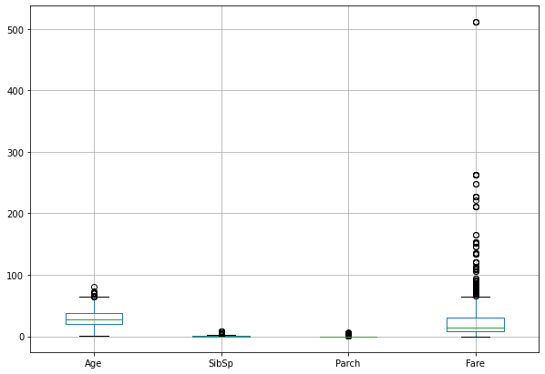
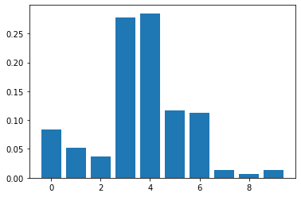

The primary objective of this project is to build a predictive Machine Learning model that predicts which passengers survived the Titanic shipwreck in April 15, 1912 using passengers data. Also, we will perform a 
variable or feature importance test in this study which will help us to better improve our predictive model and gain more insights to the given data. The main purpose of the feature importance test is to help us also determine the relative importance of each variable in the proposed predictive model.  

The dataset involved in this study contained information, such as the name, survival status, gender, ticket class, age, fare, port of embarkation, number of siblings/spouse aboard the titanic, and the number of parent/children aboard the titanic, of passengers that a-boarded the titanic which sank after colliding with an iceberg and resulted in the death of 1502 out of 2224 passengers and crew. The response or predicted variable for this study is the survival status (an indicator variable that takes a value of 1 if survived and 0 if dead). 

Since our response variable is binary (0 or 1 ), then the recommended machine learning model for this analysis is classification models. For the purposes of this study, we will explore the following classification models such as the Random forest, K-Nearest Neighbor, and Support Vector Machines to determine if any of them fits well or provides accurate predictions to the given data. We proposed these classification models because they are more robust and have the ability to capture both simple and complex patterns that maybe found in the data. The best model will be selected based on prediction accuracy.

```

```

## Importing the libraries

```python
import numpy as np
import matplotlib.pyplot as plt
import pandas as pd
from matplotlib import pyplot
from pandas.api.types import is_numeric_dtype
from sklearn.impute import SimpleImputer
from sklearn.compose import ColumnTransformer
from sklearn.preprocessing import OneHotEncoder
from sklearn.preprocessing import LabelEncoder
from sklearn.model_selection import train_test_split
from sklearn.preprocessing import StandardScaler
from sklearn.model_selection import train_test_split
from pandas import DataFrame
from sklearn.ensemble import RandomForestClassifier
from sklearn.datasets import make_classification
from sklearn.metrics import confusion_matrix, accuracy_score
from matplotlib.colors import ListedColormap
from sklearn.neighbors import KNeighborsClassifier
from sklearn.metrics import classification_report
from sklearn.metrics import roc_auc_score
from sklearn.model_selection import GridSearchCV
from sklearn.model_selection import RandomizedSearchCV
from sklearn.svm import SVC
```

## Preprocessing of dataset

The dependent or predicted variable is denoted as y. The independent variables or predictors are denoted 
as X, and includes; gender, ticket class, age, fare, port of embarkation, number of siblings/spouse aboard 
the titanic, and the number of parent/children aboard the titanic. Apart from age and fare, all other predictors are categorical and need to be encoded. Missing values in the dataset are replaced by the mode or most frequent observation. Know that missing values can also be replaced by the mean or the median.

```

```

```python
#Reference: New Encoding for X code taken from Alexis Cook’s Titanic Tutorial 
# Importing dataset and Encoding Categorical Independent variables
dataset = pd.read_csv('train.csv')
y = dataset["Survived"]
x = ["Pclass", "Sex", "SibSp", "Parch", "Embarked","Age", "Fare"]
X = pd.get_dummies(dataset[x])
# Taking care of missing values
mv = SimpleImputer(missing_values=np.nan, strategy='most_frequent')
mv.fit(X.iloc[:, 0:])
X.iloc[:, 0:]=mv.transform(X.iloc[:, 0:])
```

## Splitting the dataset into the Training set and Test set and Performing Feature Scaling

The training dataset is split into two. Splitting the training dataset into training and test/validation sets is optional in this study since a test dataset has already been provided. However, since our aim is to first identify the optimal model (the model that provides accurate predictions to the dataset) and apply this optimal model to our test data, then it makes sense for us to split the training data into training set and validation set. The training set will be used to train our model, whiles the validation set will be used to test the model. The confusion matrix and the accuracy score will be used to assess the quality of each model. Hyper-parameters of each classification model will be obtained used grid search cross-validation.

Feature scaling are performed to predictors such as the passenger's  ticket class, age, fare, number of 
siblings/spouse aboard the titanic, and the number of parent/children aboard the titanic to ensured that some 
feature are not dominated by others. Standardization helps to ensure that features take values within some ranges.

```

```

```python
X_train, X_test, y_train, y_test = train_test_split(X, y, test_size = 0.2, random_state = 0)
X_train.head()
```

<div>
<style scoped>
    .dataframe tbody tr th:only-of-type {
        vertical-align: middle;
    }

```
.dataframe tbody tr th {
    vertical-align: top;
}

.dataframe thead th {
    text-align: right;
}
```

</style>
<table border="1" class="dataframe">
  <thead>
    <tr style="text-align: right;">
      <th></th>
      <th>Pclass</th>
      <th>SibSp</th>
      <th>Parch</th>
      <th>Age</th>
      <th>Fare</th>
      <th>Sex_female</th>
      <th>Sex_male</th>
      <th>Embarked_C</th>
      <th>Embarked_Q</th>
      <th>Embarked_S</th>
    </tr>
  </thead>
  <tbody>
    <tr>
      <th>140</th>
      <td>3.0</td>
      <td>0.0</td>
      <td>2.0</td>
      <td>24.0</td>
      <td>15.2458</td>
      <td>1.0</td>
      <td>0.0</td>
      <td>1.0</td>
      <td>0.0</td>
      <td>0.0</td>
    </tr>
    <tr>
      <th>439</th>
      <td>2.0</td>
      <td>0.0</td>
      <td>0.0</td>
      <td>31.0</td>
      <td>10.5000</td>
      <td>0.0</td>
      <td>1.0</td>
      <td>0.0</td>
      <td>0.0</td>
      <td>1.0</td>
    </tr>
    <tr>
      <th>817</th>
      <td>2.0</td>
      <td>1.0</td>
      <td>1.0</td>
      <td>31.0</td>
      <td>37.0042</td>
      <td>0.0</td>
      <td>1.0</td>
      <td>1.0</td>
      <td>0.0</td>
      <td>0.0</td>
    </tr>
    <tr>
      <th>378</th>
      <td>3.0</td>
      <td>0.0</td>
      <td>0.0</td>
      <td>20.0</td>
      <td>4.0125</td>
      <td>0.0</td>
      <td>1.0</td>
      <td>1.0</td>
      <td>0.0</td>
      <td>0.0</td>
    </tr>
    <tr>
      <th>491</th>
      <td>3.0</td>
      <td>0.0</td>
      <td>0.0</td>
      <td>21.0</td>
      <td>7.2500</td>
      <td>0.0</td>
      <td>1.0</td>
      <td>0.0</td>
      <td>0.0</td>
      <td>1.0</td>
    </tr>
  </tbody>
</table>
</div>

```python
std = StandardScaler()
X_train.iloc[:, 0:5] = std.fit_transform(X_train.iloc[:, 0:5])
X_test.iloc[:, 0:5] = std.fit_transform(X_test.iloc[:, 0:5])
```

```
/Users/wisdomaselisewine/opt/anaconda3/lib/python3.8/site-packages/pandas/core/indexing.py:670: 
SettingWithCopyWarning: 
A value is trying to be set on a copy of a slice from a DataFrame

See the caveats in the documentation: https://pandas.pydata.org/pandas-docs/stable/user_guide/
indexing.html#returning-a-view-versus-a-copy
  iloc._setitem_with_indexer(indexer, value)
<ipython-input-154-f194bcc99216>:2: SettingWithCopyWarning: 
A value is trying to be set on a copy of a slice from a DataFrame

See the caveats in the documentation: https://pandas.pydata.org/pandas-docs/stable/user_guide/
indexing.html#returning-a-view-versus-a-copy
  X_train.iloc[:, 0:5] = std.fit_transform(X_train.iloc[:, 0:5])
/Users/wisdomaselisewine/opt/anaconda3/lib/python3.8/site-packages/pandas/core/indexing.py:670: 
SettingWithCopyWarning: 
A value is trying to be set on a copy of a slice from a DataFrame

See the caveats in the documentation: https://pandas.pydata.org/pandas-docs/stable/user_guide/
indexing.html#returning-a-view-versus-a-copy
  iloc._setitem_with_indexer(indexer, value)
<ipython-input-154-f194bcc99216>:3: SettingWithCopyWarning: 
A value is trying to be set on a copy of a slice from a DataFrame

See the caveats in the documentation: https://pandas.pydata.org/pandas-docs/stable/user_guide/
indexing.html#returning-a-view-versus-a-copy
  X_test.iloc[:, 0:5] = std.fit_transform(X_test.iloc[:, 0:5])
```

<div>
<style scoped>
    .dataframe tbody tr th:only-of-type {
        vertical-align: middle;
    }

```
.dataframe tbody tr th {
    vertical-align: top;
}

.dataframe thead th {
    text-align: right;
}
```

</style>
<table border="1" class="dataframe">
  <thead>
    <tr style="text-align: right;">
      <th></th>
      <th>Pclass</th>
      <th>SibSp</th>
      <th>Parch</th>
      <th>Age</th>
      <th>Fare</th>
      <th>Sex_female</th>
      <th>Sex_male</th>
      <th>Embarked_C</th>
      <th>Embarked_Q</th>
      <th>Embarked_S</th>
    </tr>
  </thead>
  <tbody>
    <tr>
      <th>140</th>
      <td>0.819251</td>
      <td>-0.464452</td>
      <td>1.959264</td>
      <td>-0.346969</td>
      <td>-0.331679</td>
      <td>1.0</td>
      <td>0.0</td>
      <td>1.0</td>
      <td>0.0</td>
      <td>0.0</td>
    </tr>
    <tr>
      <th>439</th>
      <td>-0.380968</td>
      <td>-0.464452</td>
      <td>-0.477410</td>
      <td>0.180174</td>
      <td>-0.426405</td>
      <td>0.0</td>
      <td>1.0</td>
      <td>0.0</td>
      <td>0.0</td>
      <td>1.0</td>
    </tr>
    <tr>
      <th>817</th>
      <td>-0.380968</td>
      <td>0.412710</td>
      <td>0.740927</td>
      <td>0.180174</td>
      <td>0.102620</td>
      <td>0.0</td>
      <td>1.0</td>
      <td>1.0</td>
      <td>0.0</td>
      <td>0.0</td>
    </tr>
    <tr>
      <th>378</th>
      <td>0.819251</td>
      <td>-0.464452</td>
      <td>-0.477410</td>
      <td>-0.648193</td>
      <td>-0.555896</td>
      <td>0.0</td>
      <td>1.0</td>
      <td>1.0</td>
      <td>0.0</td>
      <td>0.0</td>
    </tr>
    <tr>
      <th>491</th>
      <td>0.819251</td>
      <td>-0.464452</td>
      <td>-0.477410</td>
      <td>-0.572887</td>
      <td>-0.491276</td>
      <td>0.0</td>
      <td>1.0</td>
      <td>0.0</td>
      <td>0.0</td>
      <td>1.0</td>
    </tr>
  </tbody>
</table>
</div>

## Exploratory Data Analysis (EDA)

```python
#Reference: Code copy from MATH 5334 (Python tutorial handout)
for col in dataset.columns:
    if is_numeric_dtype(dataset[col]):
        print('%s:' % (col))
        print('\t Mean = %.2f' % dataset[col].mean())
        print('\t Standard deviation = %.2f' % dataset[col].std())
        print('\t Minimum = %.2f' % dataset[col].min())
        print('\t Maximum = %.2f' % dataset[col].max())
```

```
Age:
	 Mean = 29.70
	 Standard deviation = 14.53
	 Minimum = 0.42
	 Maximum = 80.00
SibSp:
	 Mean = 0.52
	 Standard deviation = 1.10
	 Minimum = 0.00
	 Maximum = 8.00
Parch:
	 Mean = 0.38
	 Standard deviation = 0.81
	 Minimum = 0.00
	 Maximum = 6.00
Fare:
	 Mean = 32.20
	 Standard deviation = 49.69
	 Minimum = 0.00
	 Maximum = 512.33
```

```python
#Reference: Code copy from MATH 5334 (Python tutorial handout)
print('Correlation:')
dataset.corr()
```

```
Correlation:
```

<div>
<style scoped>
    .dataframe tbody tr th:only-of-type {
        vertical-align: middle;
    }

```
.dataframe tbody tr th {
    vertical-align: top;
}

.dataframe thead th {
    text-align: right;
}
```

</style>
<table border="1" class="dataframe">
  <thead>
    <tr style="text-align: right;">
      <th></th>
      <th>PassengerId</th>
      <th>Survived</th>
      <th>Pclass</th>
      <th>Age</th>
      <th>SibSp</th>
      <th>Parch</th>
      <th>Fare</th>
    </tr>
  </thead>
  <tbody>
    <tr>
      <th>PassengerId</th>
      <td>1.000000</td>
      <td>-0.005007</td>
      <td>-0.035144</td>
      <td>0.036847</td>
      <td>-0.057527</td>
      <td>-0.001652</td>
      <td>0.012658</td>
    </tr>
    <tr>
      <th>Survived</th>
      <td>-0.005007</td>
      <td>1.000000</td>
      <td>-0.338481</td>
      <td>-0.077221</td>
      <td>-0.035322</td>
      <td>0.081629</td>
      <td>0.257307</td>
    </tr>
    <tr>
      <th>Pclass</th>
      <td>-0.035144</td>
      <td>-0.338481</td>
      <td>1.000000</td>
      <td>-0.369226</td>
      <td>0.083081</td>
      <td>0.018443</td>
      <td>-0.549500</td>
    </tr>
    <tr>
      <th>Age</th>
      <td>0.036847</td>
      <td>-0.077221</td>
      <td>-0.369226</td>
      <td>1.000000</td>
      <td>-0.308247</td>
      <td>-0.189119</td>
      <td>0.096067</td>
    </tr>
    <tr>
      <th>SibSp</th>
      <td>-0.057527</td>
      <td>-0.035322</td>
      <td>0.083081</td>
      <td>-0.308247</td>
      <td>1.000000</td>
      <td>0.414838</td>
      <td>0.159651</td>
    </tr>
    <tr>
      <th>Parch</th>
      <td>-0.001652</td>
      <td>0.081629</td>
      <td>0.018443</td>
      <td>-0.189119</td>
      <td>0.414838</td>
      <td>1.000000</td>
      <td>0.216225</td>
    </tr>
    <tr>
      <th>Fare</th>
      <td>0.012658</td>
      <td>0.257307</td>
      <td>-0.549500</td>
      <td>0.096067</td>
      <td>0.159651</td>
      <td>0.216225</td>
      <td>1.000000</td>
    </tr>
  </tbody>
</table>
</div>

```python
#Reference: Code copy from MATH 5334 (Python tutorial handout)
dataset.boxplot(figsize=(10,7))
```

```
<AxesSubplot:>
```



## Training or Building Classification Model from the Training Dataset

## 1. Random Forest Classification Model

Random forest is an ensemble learning method for classification and regression. It involves construction of a multitude of decision trees using the training data. The output of the random forest is the class selected by the majority of trees. Random forest de-correlates trees by considering only a random subset of K-variables, 
with the aim of improving prediction. Two hyper-parameters are of particular interest, the number of trees and the number of features to consider at each split. These parameters will be obtained through grid search cross-validation in this study.

```

```

```python
# Training the Random Forest Classification model on the Training set
Randomclassifier = RandomForestClassifier(n_estimators = 100, criterion = 'entropy', random_state = 1)
Randomclassifier.fit(X_train, y_train)

# Predicting the Test set results
survival_predictions = Randomclassifier.predict(X_test)

# Making the Confusion Matrix
cm = confusion_matrix(y_test, survival_predictions)

print(cm)
print(accuracy_score(y_test, survival_predictions))
Rf = accuracy_score(y_test, survival_predictions)
```

```
[[102   8]
 [ 20  49]]
0.8435754189944135
```

## Tuning Random Forest Hyper-parameters using Grid-search Cross-Validation

```python
#List of Hyperparameter
hy_param_grid = [
{'n_estimators': [10, 100, 300], 'max_features': [3, 7], 
 'max_depth': [5, 12, 20, 50, None], 'bootstrap': [True, False]}
]
grid_search_randomforest = GridSearchCV(Randomclassifier, hy_param_grid, cv=10, scoring='roc_auc')
grid_search_randomforest.fit(X_train, y_train)

#Best model of grid search
print(grid_search_randomforest.best_estimator_)
```

```
RandomForestClassifier(criterion='entropy', max_depth=5, max_features=7,
                       n_estimators=10, random_state=1)
```

## Fitting the Optimal Random Forest Model

```python
# Training the optimal Random Forest Classification model on the Training set
Randomclassifier_optimal = RandomForestClassifier(criterion='entropy', max_depth=5, max_features='auto',
                       n_estimators=10, random_state=1)
Randomclassifier_optimal.fit(X_train, y_train)

# Predicting the Test set results using the optimal model
survival_predictions_optimal = Randomclassifier_optimal.predict(X_test)

# Making the Confusion Matrix
cm = confusion_matrix(y_test, survival_predictions_optimal)

print(cm)
accuracy_score(y_test, survival_predictions_optimal)
```

```
[[105   5]
 [ 25  44]]


0.8324022346368715


The default/initial model has a prediction accuracy rate of 85.47%, whiles the optimal model has an accuracy rate of 82.68%. This implies that our default model has outperformed the supposed optimal model.
```

## 2. K-Nearest Neighbor (K-NN) Classification Model

K-NN is a non-parametric classification method used to solve both classification and regression problems. 
The K-NN classified a response variable given set of predictor values by identifying the K nearest points or neighbors in the training data that are closest to the given value. K is a hyper-parameter that can be pre-specified through cross-validation. In this study, we will first fit a K-NN model to the training data by simply specifying a default value for K. We will then tune our model parameters using the grid search cross-validation to obtain the best K for our model. The best K will then be used to fit the optimal model for this algorithm. 

```

```

```python
# Training the K-NN model on the Training set

Knnclassifier = KNeighborsClassifier(n_neighbors = 5,leaf_size=3, algorithm='auto', metric = 'minkowski', p = 1)
Knnclassifier.fit(X_train, y_train)

# Predicting the Test set results
survival_pred = Knnclassifier.predict(X_test)

# Making the Confusion Matrix
cm = confusion_matrix(y_test, survival_pred)
print(cm)
accuracy_score(y_test, survival_pred)
```

```
[[97 13]
 [19 50]]


0.8212290502793296
```

## Tuning K-NN Hyperparameters using Gridsearch Cross-Validation

```python
#List of Hyperparameters in dictionary format
hyperparameters = dict(leaf_size=list(range(3,50)), n_neighbors=list(range(5,35)), p=[1,2])
grid_search_knn = GridSearchCV(Knnclassifier, hyperparameters, cv=10)
#Fit the model
best_model = grid_search_knn.fit(X_train,y_train)
print(grid_search_knn.best_estimator_)
```

```
KNeighborsClassifier(leaf_size=3, n_neighbors=8, p=1)
```

## Fitting the Optimal K-NN Model

```python
# Training the optimal K-NN model on the Training set

knnclassifier_optimal = KNeighborsClassifier(n_neighbors = 8,leaf_size=3, algorithm='auto', metric = 'minkowski', p = 1)
knnclassifier_optimal.fit(X_train, y_train)

# Predicting the Test set results using the optimal model
survival_pred_optimal = knnclassifier_optimal.predict(X_test)

# Making the Confusion Matrix
cm = confusion_matrix(y_test, survival_pred_optimal)
print(cm)
print(accuracy_score(y_test, survival_pred_optimal))
Knn = accuracy_score(y_test, survival_pred_optimal)
```

Before tuning the K-NN parameter, the default K-NN model has a prediction accuracy rate of 82.12%. After tuning, we obtained an accuracy rate of 82.68%, which is a little improvement over of the default model.

```
[[96 14]
 [34 35]]
0.7318435754189944
```

## 3. Support Vector Machine (SVM) Classification Model

SVM is a supervised machine learning model which can be used for classification and regression. SVM is known to be one of the most robust prediction method, by being able to handle both linear and non-linear problems in machine learning. Three parameters will be considered here, the kernel, gamma, and C (Regularization parameter). These parameters are can be obtained through cross-validation.

```

```

```python
# Training the SVM model on the Training set
Svmclassifier = SVC(C=1,kernel = 'linear', gamma=0.1, random_state = 0)
Svmclassifier.fit(X_train, y_train)

# Predicting the Test set results
survival_pred = Svmclassifier.predict(X_test)

# Making the Confusion Matrix
cm = confusion_matrix(y_test, survival_pred)
print(cm)
accuracy_score(y_test, survival_pred)
```

```
[[92 18]
 [20 49]]


0.7877094972067039
```

```python
svm_hyparam_grid = {'C': [1,5, 10, 100], 'gamma': [0.01, 1, 2],'kernel': ['rbf', 'poly', 'sigmoid']}
grid_search_svm = GridSearchCV(Svmclassifier,svm_hyparam_grid,refit=True,verbose=2)
grid_search_svm.fit(X_train,y_train)
```

```
Fitting 5 folds for each of 36 candidates, totalling 180 fits
[CV] C=1, gamma=0.01, kernel=rbf .....................................
[CV] ...................... C=1, gamma=0.01, kernel=rbf, total=   0.0s
[CV] C=1, gamma=0.01, kernel=rbf .....................................
[CV] ...................... C=1, gamma=0.01, kernel=rbf, total=   0.0s
[CV] C=1, gamma=0.01, kernel=rbf .....................................
[CV] ...................... C=1, gamma=0.01, kernel=rbf, total=   0.0s
[CV] C=1, gamma=0.01, kernel=rbf .....................................
[CV] ...................... C=1, gamma=0.01, kernel=rbf, total=   0.0s
[CV] C=1, gamma=0.01, kernel=rbf .....................................
[CV] ...................... C=1, gamma=0.01, kernel=rbf, total=   0.0s
[CV] C=1, gamma=0.01, kernel=poly ....................................
[CV] ..................... C=1, gamma=0.01, kernel=poly, total=   0.0s
[CV] C=1, gamma=0.01, kernel=poly ....................................
[CV] ..................... C=1, gamma=0.01, kernel=poly, total=   0.0s
[CV] C=1, gamma=0.01, kernel=poly ....................................
[CV] ..................... C=1, gamma=0.01, kernel=poly, total=   0.0s
[CV] C=1, gamma=0.01, kernel=poly ....................................
[CV] ..................... C=1, gamma=0.01, kernel=poly, total=   0.0s
[CV] C=1, gamma=0.01, kernel=poly ....................................
[CV] ..................... C=1, gamma=0.01, kernel=poly, total=   0.0s
[CV] C=1, gamma=0.01, kernel=sigmoid .................................
[CV] .................. C=1, gamma=0.01, kernel=sigmoid, total=   0.0s
[CV] C=1, gamma=0.01, kernel=sigmoid .................................
[CV] .................. C=1, gamma=0.01, kernel=sigmoid, total=   0.0s
[CV] C=1, gamma=0.01, kernel=sigmoid .................................
[CV] .................. C=1, gamma=0.01, kernel=sigmoid, total=   0.0s
[CV] C=1, gamma=0.01, kernel=sigmoid .................................
[CV] .................. C=1, gamma=0.01, kernel=sigmoid, total=   0.0s
[CV] C=1, gamma=0.01, kernel=sigmoid .................................
[CV] .................. C=1, gamma=0.01, kernel=sigmoid, total=   0.0s
[CV] C=1, gamma=1, kernel=rbf ........................................
[CV] ......................... C=1, gamma=1, kernel=rbf, total=   0.0s
[CV] C=1, gamma=1, kernel=rbf ........................................


[Parallel(n_jobs=1)]: Using backend SequentialBackend with 1 concurrent workers.
[Parallel(n_jobs=1)]: Done   1 out of   1 | elapsed:    0.0s remaining:    0.0s


[CV] ......................... C=1, gamma=1, kernel=rbf, total=   0.0s
[CV] C=1, gamma=1, kernel=rbf ........................................
[CV] ......................... C=1, gamma=1, kernel=rbf, total=   0.0s
[CV] C=1, gamma=1, kernel=rbf ........................................
[CV] ......................... C=1, gamma=1, kernel=rbf, total=   0.0s
[CV] C=1, gamma=1, kernel=rbf ........................................
[CV] ......................... C=1, gamma=1, kernel=rbf, total=   0.0s
[CV] C=1, gamma=1, kernel=poly .......................................
[CV] ........................ C=1, gamma=1, kernel=poly, total=   0.1s
[CV] C=1, gamma=1, kernel=poly .......................................
[CV] ........................ C=1, gamma=1, kernel=poly, total=   0.2s
[CV] C=1, gamma=1, kernel=poly .......................................
[CV] ........................ C=1, gamma=1, kernel=poly, total=   0.2s
[CV] C=1, gamma=1, kernel=poly .......................................
[CV] ........................ C=1, gamma=1, kernel=poly, total=   0.1s
[CV] C=1, gamma=1, kernel=poly .......................................
[CV] ........................ C=1, gamma=1, kernel=poly, total=   0.1s
[CV] C=1, gamma=1, kernel=sigmoid ....................................
[CV] ..................... C=1, gamma=1, kernel=sigmoid, total=   0.0s
[CV] C=1, gamma=1, kernel=sigmoid ....................................
[CV] ..................... C=1, gamma=1, kernel=sigmoid, total=   0.0s
[CV] C=1, gamma=1, kernel=sigmoid ....................................
[CV] ..................... C=1, gamma=1, kernel=sigmoid, total=   0.0s
[CV] C=1, gamma=1, kernel=sigmoid ....................................
[CV] ..................... C=1, gamma=1, kernel=sigmoid, total=   0.0s
[CV] C=1, gamma=1, kernel=sigmoid ....................................
[CV] ..................... C=1, gamma=1, kernel=sigmoid, total=   0.0s
[CV] C=1, gamma=2, kernel=rbf ........................................
[CV] ......................... C=1, gamma=2, kernel=rbf, total=   0.0s
[CV] C=1, gamma=2, kernel=rbf ........................................
[CV] ......................... C=1, gamma=2, kernel=rbf, total=   0.0s
[CV] C=1, gamma=2, kernel=rbf ........................................
[CV] ......................... C=1, gamma=2, kernel=rbf, total=   0.0s
[CV] C=1, gamma=2, kernel=rbf ........................................
[CV] ......................... C=1, gamma=2, kernel=rbf, total=   0.0s
[CV] C=1, gamma=2, kernel=rbf ........................................
[CV] ......................... C=1, gamma=2, kernel=rbf, total=   0.0s
[CV] C=1, gamma=2, kernel=poly .......................................
[CV] ........................ C=1, gamma=2, kernel=poly, total=   0.3s
[CV] C=1, gamma=2, kernel=poly .......................................
[CV] ........................ C=1, gamma=2, kernel=poly, total=   0.6s
[CV] C=1, gamma=2, kernel=poly .......................................
[CV] ........................ C=1, gamma=2, kernel=poly, total=   0.6s
[CV] C=1, gamma=2, kernel=poly .......................................
[CV] ........................ C=1, gamma=2, kernel=poly, total=   0.3s
[CV] C=1, gamma=2, kernel=poly .......................................
[CV] ........................ C=1, gamma=2, kernel=poly, total=   1.2s
[CV] C=1, gamma=2, kernel=sigmoid ....................................
[CV] ..................... C=1, gamma=2, kernel=sigmoid, total=   0.0s
[CV] C=1, gamma=2, kernel=sigmoid ....................................
[CV] ..................... C=1, gamma=2, kernel=sigmoid, total=   0.0s
[CV] C=1, gamma=2, kernel=sigmoid ....................................
[CV] ..................... C=1, gamma=2, kernel=sigmoid, total=   0.0s
[CV] C=1, gamma=2, kernel=sigmoid ....................................
[CV] ..................... C=1, gamma=2, kernel=sigmoid, total=   0.0s
[CV] C=1, gamma=2, kernel=sigmoid ....................................
[CV] ..................... C=1, gamma=2, kernel=sigmoid, total=   0.0s
[CV] C=5, gamma=0.01, kernel=rbf .....................................
[CV] ...................... C=5, gamma=0.01, kernel=rbf, total=   0.0s
[CV] C=5, gamma=0.01, kernel=rbf .....................................
[CV] ...................... C=5, gamma=0.01, kernel=rbf, total=   0.0s
[CV] C=5, gamma=0.01, kernel=rbf .....................................
[CV] ...................... C=5, gamma=0.01, kernel=rbf, total=   0.0s
[CV] C=5, gamma=0.01, kernel=rbf .....................................
[CV] ...................... C=5, gamma=0.01, kernel=rbf, total=   0.0s
[CV] C=5, gamma=0.01, kernel=rbf .....................................
[CV] ...................... C=5, gamma=0.01, kernel=rbf, total=   0.0s
[CV] C=5, gamma=0.01, kernel=poly ....................................
[CV] ..................... C=5, gamma=0.01, kernel=poly, total=   0.0s
[CV] C=5, gamma=0.01, kernel=poly ....................................
[CV] ..................... C=5, gamma=0.01, kernel=poly, total=   0.0s
[CV] C=5, gamma=0.01, kernel=poly ....................................
[CV] ..................... C=5, gamma=0.01, kernel=poly, total=   0.0s
[CV] C=5, gamma=0.01, kernel=poly ....................................
[CV] ..................... C=5, gamma=0.01, kernel=poly, total=   0.0s
[CV] C=5, gamma=0.01, kernel=poly ....................................
[CV] ..................... C=5, gamma=0.01, kernel=poly, total=   0.0s
[CV] C=5, gamma=0.01, kernel=sigmoid .................................
[CV] .................. C=5, gamma=0.01, kernel=sigmoid, total=   0.0s
[CV] C=5, gamma=0.01, kernel=sigmoid .................................
[CV] .................. C=5, gamma=0.01, kernel=sigmoid, total=   0.0s
[CV] C=5, gamma=0.01, kernel=sigmoid .................................
[CV] .................. C=5, gamma=0.01, kernel=sigmoid, total=   0.0s
[CV] C=5, gamma=0.01, kernel=sigmoid .................................
[CV] .................. C=5, gamma=0.01, kernel=sigmoid, total=   0.0s
[CV] C=5, gamma=0.01, kernel=sigmoid .................................
[CV] .................. C=5, gamma=0.01, kernel=sigmoid, total=   0.0s
[CV] C=5, gamma=1, kernel=rbf ........................................
[CV] ......................... C=5, gamma=1, kernel=rbf, total=   0.0s
[CV] C=5, gamma=1, kernel=rbf ........................................
[CV] ......................... C=5, gamma=1, kernel=rbf, total=   0.0s
[CV] C=5, gamma=1, kernel=rbf ........................................
[CV] ......................... C=5, gamma=1, kernel=rbf, total=   0.0s
[CV] C=5, gamma=1, kernel=rbf ........................................
[CV] ......................... C=5, gamma=1, kernel=rbf, total=   0.0s
[CV] C=5, gamma=1, kernel=rbf ........................................
[CV] ......................... C=5, gamma=1, kernel=rbf, total=   0.0s
[CV] C=5, gamma=1, kernel=poly .......................................
[CV] ........................ C=5, gamma=1, kernel=poly, total=   0.2s
[CV] C=5, gamma=1, kernel=poly .......................................
[CV] ........................ C=5, gamma=1, kernel=poly, total=   0.7s
[CV] C=5, gamma=1, kernel=poly .......................................
[CV] ........................ C=5, gamma=1, kernel=poly, total=   0.3s
[CV] C=5, gamma=1, kernel=poly .......................................
[CV] ........................ C=5, gamma=1, kernel=poly, total=   0.3s
[CV] C=5, gamma=1, kernel=poly .......................................
[CV] ........................ C=5, gamma=1, kernel=poly, total=   0.6s
[CV] C=5, gamma=1, kernel=sigmoid ....................................
[CV] ..................... C=5, gamma=1, kernel=sigmoid, total=   0.0s
[CV] C=5, gamma=1, kernel=sigmoid ....................................
[CV] ..................... C=5, gamma=1, kernel=sigmoid, total=   0.0s
[CV] C=5, gamma=1, kernel=sigmoid ....................................
[CV] ..................... C=5, gamma=1, kernel=sigmoid, total=   0.0s
[CV] C=5, gamma=1, kernel=sigmoid ....................................
[CV] ..................... C=5, gamma=1, kernel=sigmoid, total=   0.0s
[CV] C=5, gamma=1, kernel=sigmoid ....................................
[CV] ..................... C=5, gamma=1, kernel=sigmoid, total=   0.0s
[CV] C=5, gamma=2, kernel=rbf ........................................
[CV] ......................... C=5, gamma=2, kernel=rbf, total=   0.0s
[CV] C=5, gamma=2, kernel=rbf ........................................
[CV] ......................... C=5, gamma=2, kernel=rbf, total=   0.0s
[CV] C=5, gamma=2, kernel=rbf ........................................
[CV] ......................... C=5, gamma=2, kernel=rbf, total=   0.0s
[CV] C=5, gamma=2, kernel=rbf ........................................
[CV] ......................... C=5, gamma=2, kernel=rbf, total=   0.0s
[CV] C=5, gamma=2, kernel=rbf ........................................
[CV] ......................... C=5, gamma=2, kernel=rbf, total=   0.0s
[CV] C=5, gamma=2, kernel=poly .......................................
[CV] ........................ C=5, gamma=2, kernel=poly, total=   1.5s
[CV] C=5, gamma=2, kernel=poly .......................................
[CV] ........................ C=5, gamma=2, kernel=poly, total=   1.4s
[CV] C=5, gamma=2, kernel=poly .......................................
[CV] ........................ C=5, gamma=2, kernel=poly, total=   1.5s
[CV] C=5, gamma=2, kernel=poly .......................................
[CV] ........................ C=5, gamma=2, kernel=poly, total=   1.1s
[CV] C=5, gamma=2, kernel=poly .......................................
[CV] ........................ C=5, gamma=2, kernel=poly, total=   3.7s
[CV] C=5, gamma=2, kernel=sigmoid ....................................
[CV] ..................... C=5, gamma=2, kernel=sigmoid, total=   0.0s
[CV] C=5, gamma=2, kernel=sigmoid ....................................
[CV] ..................... C=5, gamma=2, kernel=sigmoid, total=   0.0s
[CV] C=5, gamma=2, kernel=sigmoid ....................................
[CV] ..................... C=5, gamma=2, kernel=sigmoid, total=   0.0s
[CV] C=5, gamma=2, kernel=sigmoid ....................................
[CV] ..................... C=5, gamma=2, kernel=sigmoid, total=   0.0s
[CV] C=5, gamma=2, kernel=sigmoid ....................................
[CV] ..................... C=5, gamma=2, kernel=sigmoid, total=   0.0s
[CV] C=10, gamma=0.01, kernel=rbf ....................................
[CV] ..................... C=10, gamma=0.01, kernel=rbf, total=   0.0s
[CV] C=10, gamma=0.01, kernel=rbf ....................................
[CV] ..................... C=10, gamma=0.01, kernel=rbf, total=   0.0s
[CV] C=10, gamma=0.01, kernel=rbf ....................................
[CV] ..................... C=10, gamma=0.01, kernel=rbf, total=   0.0s
[CV] C=10, gamma=0.01, kernel=rbf ....................................
[CV] ..................... C=10, gamma=0.01, kernel=rbf, total=   0.0s
[CV] C=10, gamma=0.01, kernel=rbf ....................................
[CV] ..................... C=10, gamma=0.01, kernel=rbf, total=   0.0s
[CV] C=10, gamma=0.01, kernel=poly ...................................
[CV] .................... C=10, gamma=0.01, kernel=poly, total=   0.0s
[CV] C=10, gamma=0.01, kernel=poly ...................................
[CV] .................... C=10, gamma=0.01, kernel=poly, total=   0.0s
[CV] C=10, gamma=0.01, kernel=poly ...................................
[CV] .................... C=10, gamma=0.01, kernel=poly, total=   0.0s
[CV] C=10, gamma=0.01, kernel=poly ...................................
[CV] .................... C=10, gamma=0.01, kernel=poly, total=   0.0s
[CV] C=10, gamma=0.01, kernel=poly ...................................
[CV] .................... C=10, gamma=0.01, kernel=poly, total=   0.0s
[CV] C=10, gamma=0.01, kernel=sigmoid ................................
[CV] ................. C=10, gamma=0.01, kernel=sigmoid, total=   0.0s
[CV] C=10, gamma=0.01, kernel=sigmoid ................................
[CV] ................. C=10, gamma=0.01, kernel=sigmoid, total=   0.0s
[CV] C=10, gamma=0.01, kernel=sigmoid ................................
[CV] ................. C=10, gamma=0.01, kernel=sigmoid, total=   0.0s
[CV] C=10, gamma=0.01, kernel=sigmoid ................................
[CV] ................. C=10, gamma=0.01, kernel=sigmoid, total=   0.0s
[CV] C=10, gamma=0.01, kernel=sigmoid ................................
[CV] ................. C=10, gamma=0.01, kernel=sigmoid, total=   0.0s
[CV] C=10, gamma=1, kernel=rbf .......................................
[CV] ........................ C=10, gamma=1, kernel=rbf, total=   0.0s
[CV] C=10, gamma=1, kernel=rbf .......................................
[CV] ........................ C=10, gamma=1, kernel=rbf, total=   0.0s
[CV] C=10, gamma=1, kernel=rbf .......................................
[CV] ........................ C=10, gamma=1, kernel=rbf, total=   0.0s
[CV] C=10, gamma=1, kernel=rbf .......................................
[CV] ........................ C=10, gamma=1, kernel=rbf, total=   0.0s
[CV] C=10, gamma=1, kernel=rbf .......................................
[CV] ........................ C=10, gamma=1, kernel=rbf, total=   0.0s
[CV] C=10, gamma=1, kernel=poly ......................................
[CV] ....................... C=10, gamma=1, kernel=poly, total=   0.5s
[CV] C=10, gamma=1, kernel=poly ......................................
[CV] ....................... C=10, gamma=1, kernel=poly, total=   1.0s
[CV] C=10, gamma=1, kernel=poly ......................................
[CV] ....................... C=10, gamma=1, kernel=poly, total=   0.6s
[CV] C=10, gamma=1, kernel=poly ......................................
[CV] ....................... C=10, gamma=1, kernel=poly, total=   0.3s
[CV] C=10, gamma=1, kernel=poly ......................................
[CV] ....................... C=10, gamma=1, kernel=poly, total=   1.1s
[CV] C=10, gamma=1, kernel=sigmoid ...................................
[CV] .................... C=10, gamma=1, kernel=sigmoid, total=   0.0s
[CV] C=10, gamma=1, kernel=sigmoid ...................................
[CV] .................... C=10, gamma=1, kernel=sigmoid, total=   0.0s
[CV] C=10, gamma=1, kernel=sigmoid ...................................
[CV] .................... C=10, gamma=1, kernel=sigmoid, total=   0.0s
[CV] C=10, gamma=1, kernel=sigmoid ...................................
[CV] .................... C=10, gamma=1, kernel=sigmoid, total=   0.0s
[CV] C=10, gamma=1, kernel=sigmoid ...................................
[CV] .................... C=10, gamma=1, kernel=sigmoid, total=   0.0s
[CV] C=10, gamma=2, kernel=rbf .......................................
[CV] ........................ C=10, gamma=2, kernel=rbf, total=   0.0s
[CV] C=10, gamma=2, kernel=rbf .......................................
[CV] ........................ C=10, gamma=2, kernel=rbf, total=   0.0s
[CV] C=10, gamma=2, kernel=rbf .......................................
[CV] ........................ C=10, gamma=2, kernel=rbf, total=   0.0s
[CV] C=10, gamma=2, kernel=rbf .......................................
[CV] ........................ C=10, gamma=2, kernel=rbf, total=   0.0s
[CV] C=10, gamma=2, kernel=rbf .......................................
[CV] ........................ C=10, gamma=2, kernel=rbf, total=   0.0s
[CV] C=10, gamma=2, kernel=poly ......................................
[CV] ....................... C=10, gamma=2, kernel=poly, total=   3.6s
[CV] C=10, gamma=2, kernel=poly ......................................
[CV] ....................... C=10, gamma=2, kernel=poly, total=   2.7s
[CV] C=10, gamma=2, kernel=poly ......................................
[CV] ....................... C=10, gamma=2, kernel=poly, total=   2.1s
[CV] C=10, gamma=2, kernel=poly ......................................
[CV] ....................... C=10, gamma=2, kernel=poly, total=   2.0s
[CV] C=10, gamma=2, kernel=poly ......................................
[CV] ....................... C=10, gamma=2, kernel=poly, total=   6.9s
[CV] C=10, gamma=2, kernel=sigmoid ...................................
[CV] .................... C=10, gamma=2, kernel=sigmoid, total=   0.0s
[CV] C=10, gamma=2, kernel=sigmoid ...................................
[CV] .................... C=10, gamma=2, kernel=sigmoid, total=   0.0s
[CV] C=10, gamma=2, kernel=sigmoid ...................................
[CV] .................... C=10, gamma=2, kernel=sigmoid, total=   0.0s
[CV] C=10, gamma=2, kernel=sigmoid ...................................
[CV] .................... C=10, gamma=2, kernel=sigmoid, total=   0.0s
[CV] C=10, gamma=2, kernel=sigmoid ...................................
[CV] .................... C=10, gamma=2, kernel=sigmoid, total=   0.0s
[CV] C=100, gamma=0.01, kernel=rbf ...................................
[CV] .................... C=100, gamma=0.01, kernel=rbf, total=   0.0s
[CV] C=100, gamma=0.01, kernel=rbf ...................................
[CV] .................... C=100, gamma=0.01, kernel=rbf, total=   0.0s
[CV] C=100, gamma=0.01, kernel=rbf ...................................
[CV] .................... C=100, gamma=0.01, kernel=rbf, total=   0.0s
[CV] C=100, gamma=0.01, kernel=rbf ...................................
[CV] .................... C=100, gamma=0.01, kernel=rbf, total=   0.0s
[CV] C=100, gamma=0.01, kernel=rbf ...................................
[CV] .................... C=100, gamma=0.01, kernel=rbf, total=   0.0s
[CV] C=100, gamma=0.01, kernel=poly ..................................
[CV] ................... C=100, gamma=0.01, kernel=poly, total=   0.0s
[CV] C=100, gamma=0.01, kernel=poly ..................................
[CV] ................... C=100, gamma=0.01, kernel=poly, total=   0.0s
[CV] C=100, gamma=0.01, kernel=poly ..................................
[CV] ................... C=100, gamma=0.01, kernel=poly, total=   0.0s
[CV] C=100, gamma=0.01, kernel=poly ..................................
[CV] ................... C=100, gamma=0.01, kernel=poly, total=   0.0s
[CV] C=100, gamma=0.01, kernel=poly ..................................
[CV] ................... C=100, gamma=0.01, kernel=poly, total=   0.0s
[CV] C=100, gamma=0.01, kernel=sigmoid ...............................
[CV] ................ C=100, gamma=0.01, kernel=sigmoid, total=   0.0s
[CV] C=100, gamma=0.01, kernel=sigmoid ...............................
[CV] ................ C=100, gamma=0.01, kernel=sigmoid, total=   0.0s
[CV] C=100, gamma=0.01, kernel=sigmoid ...............................
[CV] ................ C=100, gamma=0.01, kernel=sigmoid, total=   0.0s
[CV] C=100, gamma=0.01, kernel=sigmoid ...............................
[CV] ................ C=100, gamma=0.01, kernel=sigmoid, total=   0.0s
[CV] C=100, gamma=0.01, kernel=sigmoid ...............................
[CV] ................ C=100, gamma=0.01, kernel=sigmoid, total=   0.0s
[CV] C=100, gamma=1, kernel=rbf ......................................
[CV] ....................... C=100, gamma=1, kernel=rbf, total=   0.1s
[CV] C=100, gamma=1, kernel=rbf ......................................
[CV] ....................... C=100, gamma=1, kernel=rbf, total=   0.0s
[CV] C=100, gamma=1, kernel=rbf ......................................
[CV] ....................... C=100, gamma=1, kernel=rbf, total=   0.0s
[CV] C=100, gamma=1, kernel=rbf ......................................
[CV] ....................... C=100, gamma=1, kernel=rbf, total=   0.0s
[CV] C=100, gamma=1, kernel=rbf ......................................
[CV] ....................... C=100, gamma=1, kernel=rbf, total=   0.0s
[CV] C=100, gamma=1, kernel=poly .....................................
[CV] ...................... C=100, gamma=1, kernel=poly, total=   8.3s
[CV] C=100, gamma=1, kernel=poly .....................................
[CV] ...................... C=100, gamma=1, kernel=poly, total=   5.2s
[CV] C=100, gamma=1, kernel=poly .....................................
[CV] ...................... C=100, gamma=1, kernel=poly, total=   3.4s
[CV] C=100, gamma=1, kernel=poly .....................................
[CV] ...................... C=100, gamma=1, kernel=poly, total=   2.3s
[CV] C=100, gamma=1, kernel=poly .....................................
[CV] ...................... C=100, gamma=1, kernel=poly, total=   6.4s
[CV] C=100, gamma=1, kernel=sigmoid ..................................
[CV] ................... C=100, gamma=1, kernel=sigmoid, total=   0.0s
[CV] C=100, gamma=1, kernel=sigmoid ..................................
[CV] ................... C=100, gamma=1, kernel=sigmoid, total=   0.0s
[CV] C=100, gamma=1, kernel=sigmoid ..................................
[CV] ................... C=100, gamma=1, kernel=sigmoid, total=   0.0s
[CV] C=100, gamma=1, kernel=sigmoid ..................................
[CV] ................... C=100, gamma=1, kernel=sigmoid, total=   0.0s
[CV] C=100, gamma=1, kernel=sigmoid ..................................
[CV] ................... C=100, gamma=1, kernel=sigmoid, total=   0.0s
[CV] C=100, gamma=2, kernel=rbf ......................................
[CV] ....................... C=100, gamma=2, kernel=rbf, total=   0.0s
[CV] C=100, gamma=2, kernel=rbf ......................................
[CV] ....................... C=100, gamma=2, kernel=rbf, total=   0.1s
[CV] C=100, gamma=2, kernel=rbf ......................................
[CV] ....................... C=100, gamma=2, kernel=rbf, total=   0.0s
[CV] C=100, gamma=2, kernel=rbf ......................................
[CV] ....................... C=100, gamma=2, kernel=rbf, total=   0.0s
[CV] C=100, gamma=2, kernel=rbf ......................................
[CV] ....................... C=100, gamma=2, kernel=rbf, total=   0.1s
[CV] C=100, gamma=2, kernel=poly .....................................
[CV] ...................... C=100, gamma=2, kernel=poly, total=  21.1s
[CV] C=100, gamma=2, kernel=poly .....................................
[CV] ...................... C=100, gamma=2, kernel=poly, total=  26.3s
[CV] C=100, gamma=2, kernel=poly .....................................
[CV] ...................... C=100, gamma=2, kernel=poly, total=  24.2s
[CV] C=100, gamma=2, kernel=poly .....................................
[CV] ...................... C=100, gamma=2, kernel=poly, total=  33.3s
[CV] C=100, gamma=2, kernel=poly .....................................
[CV] ...................... C=100, gamma=2, kernel=poly, total= 1.1min
[CV] C=100, gamma=2, kernel=sigmoid ..................................
[CV] ................... C=100, gamma=2, kernel=sigmoid, total=   0.0s
[CV] C=100, gamma=2, kernel=sigmoid ..................................
[CV] ................... C=100, gamma=2, kernel=sigmoid, total=   0.0s
[CV] C=100, gamma=2, kernel=sigmoid ..................................
[CV] ................... C=100, gamma=2, kernel=sigmoid, total=   0.0s
[CV] C=100, gamma=2, kernel=sigmoid ..................................
[CV] ................... C=100, gamma=2, kernel=sigmoid, total=   0.0s
[CV] C=100, gamma=2, kernel=sigmoid ..................................
[CV] ................... C=100, gamma=2, kernel=sigmoid, total=   0.0s


[Parallel(n_jobs=1)]: Done 180 out of 180 | elapsed:  3.9min finished


GridSearchCV(estimator=SVC(C=1, gamma=2, random_state=1),
             param_grid={'C': [1, 5, 10, 100], 'gamma': [0.01, 1, 2],
                         'kernel': ['rbf', 'poly', 'sigmoid']},
             verbose=2)
```

```python
print(grid_search_svm.best_estimator_)
```

```
SVC(C=100, gamma=0.01, random_state=1)
```

## Fitting the Optimal SVM Model

```python
# Training the optimal SVM model on the Training set
Svmclassifier = SVC(C=100,kernel = 'linear', gamma=0.01, random_state = 1)
Svmclassifier.fit(X_train, y_train)

# Predicting the Test set results using the optimal model
survival_pred = Svmclassifier.predict(X_test)

# Making the Confusion Matrix
cm = confusion_matrix(y_test, survival_pred)
print(cm)
accuracy_score(y_test, survival_pred)
```

```
[[96 14]
 [21 48]]


0.8044692737430168
```

```python
# Training the optimal SVM model on the Training set
Svmclassifier = SVC(C=100,kernel = 'poly', gamma=0.01, random_state = 1)
Svmclassifier.fit(X_train, y_train)

# Predicting the Test set results using the optimal model
survival_pred = Svmclassifier.predict(X_test)

# Making the Confusion Matrix
cm = confusion_matrix(y_test, survival_pred)
print(cm)
accuracy_score(y_test, survival_pred)
```

```
[[109   1]
 [ 57  12]]


0.6759776536312849
```

```python
# Training the optimal SVM model on the Training set
Svmclassifier = SVC(C=100,kernel = 'rbf', gamma=0.01, random_state = 1)
Svmclassifier.fit(X_train, y_train)

# Predicting the Test set results using the optimal model
survival_pred = Svmclassifier.predict(X_test)

# Making the Confusion Matrix
cm = confusion_matrix(y_test, survival_pred)
print(cm)
accuracy_score(y_test, survival_pred)
```

```
[[96 14]
 [21 48]]


0.8044692737430168
```

```python
# Training the optimal SVM model on the Training set
Svmclassifier = SVC(C=100,kernel = 'sigmoid', gamma=0.01, random_state = 1)
Svmclassifier.fit(X_train, y_train)

# Predicting the Test set results using the optimal model
survival_pred = Svmclassifier.predict(X_test)

# Making the Confusion Matrix
cm = confusion_matrix(y_test, survival_pred)
print(cm)
accuracy_score(y_test, survival_pred)
```

```
[[94 16]
 [18 51]]


0.8100558659217877
```

```python
# Training the optimal SVM model on the Training set
Svmclassifier = SVC(C=1,kernel = 'rbf', gamma=2, random_state = 1)
Svmclassifier.fit(X_train, y_train)

# Predicting the Test set results using the optimal model
survival_pred = Svmclassifier.predict(X_test)

# Making the Confusion Matrix
cm = confusion_matrix(y_test, survival_pred)
print(cm)
Svm = accuracy_score(y_test, survival_pred)
```

The best optimal model obtained here has an accuracy rate of 82.12%, which is far higher than the accuracy rate obtained by the default model (78.77%). Therefore, the best model is the optimal model.

```
[[102   8]
 [ 24  45]]
```

## Final Model Selection

The final model is selected by comparing the predictive accuracy rate of best models from each classification model. The final model will then be considered as our proposed optimal predictive model. The proposed optimal predictive model will the be used to predict which passengers survived the titanic.

```

```

```python
cars = {'Model': ['Random Forest', 'K-NN', 'SVM'],
       'Accuracy': [Rf, Knn, Svm]} 
DataFrame(cars)
```

<div>
<style scoped>
    .dataframe tbody tr th:only-of-type {
        vertical-align: middle;
    }

```
.dataframe tbody tr th {
    vertical-align: top;
}

.dataframe thead th {
    text-align: right;
}
```

</style>
<table border="1" class="dataframe">
  <thead>
    <tr style="text-align: right;">
      <th></th>
      <th>Model</th>
      <th>Accuracy</th>
    </tr>
  </thead>
  <tbody>
    <tr>
      <th>0</th>
      <td>Random Forest</td>
      <td>0.854749</td>
    </tr>
    <tr>
      <th>1</th>
      <td>K-NN</td>
      <td>0.826816</td>
    </tr>
    <tr>
      <th>2</th>
      <td>SVM</td>
      <td>0.821229</td>
    </tr>
  </tbody>
</table>
</div>

Since the Random Forest model has the highest predictive accuracy, the final optimal predictive model is the random forest model. We will therefore use the random forest model for our final predictions.

```

```

## Final Model

```python
#Reference: New Encoding for X code taken from Alexis Cook’s Titanic Tutorial 
train_dataset = pd.read_csv("train.csv")
test_dataset = pd.read_csv("test.csv")
# Importing dataset and Encoding Categorical Independent variables
y = train_dataset["Survived"]
features = ["Pclass", "Sex", "SibSp", "Parch", "Embarked","Age", "Fare"]
X_train = pd.get_dummies(train_dataset[features])
X_test = pd.get_dummies(test_dataset[features])
# Taking care of missing values
mv = SimpleImputer(missing_values=np.nan, strategy='most_frequent')
mv.fit(X_train.iloc[:, 0:])
mv.fit(X_test.iloc[:, 0:])
X_train.iloc[:, 0:]=mv.transform(X_train.iloc[:, 0:])
X_test.iloc[:, 0:]=mv.transform(X_test.iloc[:, 0:])
```

```python
#X_train, X_test, y_train, y_test = train_test_split(X, y, test_size = 0.2, random_state = 0)
dd = StandardScaler()
X_train.iloc[:, 0:5] = dd.fit_transform(X_train.iloc[:, 0:5])
X_test.iloc[:, 0:5] = dd.fit_transform(X_test.iloc[:, 0:5])
```

```python
# Training a Random Forest Classification model on the Training set
Optimal_model = RandomForestClassifier(n_estimators = 100, max_features='auto', criterion = 'entropy', random_state = 1)
Optimal_model.fit(X_train, y)
y_pred = Optimal_model.predict(X_test)
output = pd.DataFrame({'PassengerId': test_dataset.PassengerId, 'Survived': y_pred})
print(output)
```

CONGRATULATIONS! After submitting our results to the Kaggle's Titanic Machine Learning Competition, we obtained a score of 0.78468 accuracy rate.

```
     PassengerId  Survived
0            892         0
1            893         0
2            894         0
3            895         0
4            896         0
..           ...       ...
413         1305         0
414         1306         1
415         1307         0
416         1308         0
417         1309         1

[418 rows x 2 columns]
```

## Feature Importance using Optimal Model

```python
#reference: Code taken from Jason Brownlee on March 30, 2020 in Data Preparation
# get importance
importance = Optimal_model.feature_importances_
# summarize feature importance
for i,v in enumerate(importance):
print('Feature: %0d, Score: %.5f' % (i,v))
# plot feature importance
pyplot.bar([x for x in range(len(importance))], importance)
pyplot.show()
```

```
Feature: 0, Score: 0.08419
Feature: 1, Score: 0.05219
Feature: 2, Score: 0.03727
Feature: 3, Score: 0.27805
Feature: 4, Score: 0.28522
Feature: 5, Score: 0.11672
Feature: 6, Score: 0.11309
Feature: 7, Score: 0.01291
Feature: 8, Score: 0.00684
Feature: 9, Score: 0.01351
```



The feature importance results obtained above indicates that passengers fare plays a very significant role in predicting which passenger survived the titanic since it has the highest score of 0.285. This is immediately followed by the age of the passenger with a score of 0.278. This appears to make sense because generally we do not expect children under 10 years and some elderly people above 60 years (minimum age 0.42 years, mean age 29.7 years, and maximum age 80 years) who were also in the ship to be strong enough to swim on their own without life-jacket for a longtime (since there was shortage of life-jackets). Interestingly, the port of embarkation does not contribute much to the predictions.

```

```

## Challenges

The main challenge I faced in this project is obtaining the right hyper-parameter estimate for each classification model. Ordinarily specifying parameter values does not help to obtain the optimal prediction model. To resolve this, the grid search cross-validation technique was used to obtain parameters by tuning across a range of parameter values.

```

```

## Contributions

The main objective of the study is to build a predictive model that predicts which passenger survived the titanic shipwreck. To make sure we obtain the best predictive model, we decided to fit the data to three different robust classification models, namely, Random Forest, K-NN, and SVM. This will help us to first identify which of those models fits well into the given data. We then selected the optimal or the best model from these fitted models by comparing their accuracy rate. 

Before fitting any model to the data, we first performed data preprocessing and feature scaling. The data preprocessing will help to take care of the missing values found in the dataset whiles the feature scaling will help to make sure all features are on the same scale, and no feature has the tendency to dominate the other. 

Also, the training data was split into two: 80% training set, which was used to train the preliminary models, and the 20% validation set, which will be used to test the accuracy rates of our preliminary models. This step is important because it will help us to be able to select an optimal model to be used for predictions on the given test data. 

After fitting each preliminary model, we tune each model's parameter values using cross-validation to make sure the best parameter values were being used in each fit. Three best preliminary models were selected at the preliminary stage, each from Random Forest, K-Nearest Neighbor, and Support Vector Machine, for comparisons. It turned out that the Random Forest model outperformed the other two models. We therefore, proposed the Random Forest model as the best predictive model for the given data. We performed prediction on the given test data using our proposed Random Forest model. 

Submitting the results to Kaggle, the proposed model had a score of 0.78468. We also performed predictions on the given test data using the other two models; K-NN and SVM. We obtained scores of 0.74162 and 0.77990 respectively for K-NN and SVM. The proves or confirms our proposed Random Forest model is indeed optimal.

```

```

## References

1. https://scikitlearn.org/stable/modules/generated/sklearn.neighbors.KNeighborsClassifier.html#sklearn.neighbors.KNeighborsClassifier
2. https://scikit-learn.org/stable/modules/model_evaluation.html#scoring-parameter
3. https://machinelearningmastery.com/calculate-feature-importance-with-python/
4. https://www.kaggle.com/alexisbcook/titanic-tutorial

```

```